# Chapter 1: Introduction to Java

## 1.0 Why Learn Java?

This is a course about object-oriented software design, so why not stick with Python,
a language you're already familiar with? This is a common question at the beginning of
CSC207! While we could continue to work with Python,
there are several benefits to learning Java, including:

- Java remains one of the most widely used programming languages in industry,
  especially in enterprise software and large-scale systems.
- By comparing the Python and Java implementations of OOP, you'll gain a deeper
  understanding of OOP fundamentals.
- As you continue in computer science, you'll encounter many programming languages.
  Learning Java now helps you build the skills to pick up new languages more easily.

In the next course, CSC209, you'll work with C programming language that operates
much closer to the hardware. Java sits between Python and C in terms of abstraction.
It’s still high-level, but introduces features like static typing and manual compilation,
which prepare you for working with C.

Before we get to any code, we'll learn just a bit about how Java works.

### 1.0.1 Running a Program

Let’s take a step back: what does it mean to “run” a program?

When you write code in a high-level language like Java or Python, the computer
can’t directly understand it. The code must be translated into machine code
that is eventually executed on the physical hardware.

There are two main ways this translation happens:

- **Interpretation**: The program is read and executed line-by-line by another
  program called an interpreter. (e.g., Python)
- **Compilation**: The entire program is translated into machine code ahead of
  time by a compiler, producing an executable file. (e.g., C)

Java uses a combination of these two in a hybrid approach.
The Java compiler (`javac`) translates source code into **bytecode**,
an intermediate form. The **Java Virtual Machine (JVM)** then interprets and
optimizes this bytecode at runtime.

To run a Java program, you must first **compile** it and then **execute** it.

If you had a simple program in a file called `HelloWorld.java`,
you could compile it by running `javac HelloWorld.java` in the terminal. This produces a file called
`HelloWorld.class`, which contains the bytecode. To then run the program,
you could run `java HelloWorld` in the terminal.

> Note: If `javac` isn't on your "PATH", then you won't be able to directly run
> this command without some configuration steps.

As projects grow in complexity, you may have hundreds of source code files
that need to be compiled. Directly running `javac` yourself would be tedious,
so modern development environments like IntelliJ automate this process using
**build systems** such as Maven or Gradle. These tools manage compilation,
dependencies, and execution, allowing you to focus on writing code. However,
understanding the underlying process is important — especially if you plan
to later take CSC209, where you'll need to compile C programs without the
help of your IDE.

### 1.0.2 Computer Architecture

As we just learned, Java programs need to be compiled before they are then run.
To better understand why Java is designed in this way, we'll take a very high-level
look at computer architecture.

In earlier courses (CSC108/148 and CSC110/111), you focused on writing applications.
But those applications don’t run in isolation — they rely on the
**operating system (OS)** to manage resources and interact with hardware.
The OS acts as a bridge between your program and the physical computer.
It handles tasks like memory management, file access, and process scheduling.

Here’s a simplified view of the architecture:

```
Applications
---------------
Operating System
---------------
Hardware
```

Notice how we visualize this architecture in **layers** — we'll talk much
more about this fundamental idea of layers throughout the course.

A language like C is compiled directly into machine code that runs on a specific OS.
This means the compiled program is **not portable** — it must be recompiled for
each operating system that it will run on!

---

#### 1.0.2.1 Virtual Machine Architecture

A **Virtual Machine (VM)** is a software application that simulates a computer.
It provides a consistent environment for running programs, regardless of the
underlying OS.

A language like Java uses VMs to achieve **portability**. A program written for a
VM can run on _any system that has the appropriate VM installed_.

We can update our computer architecture diagram to include this new layer between
the applications layer and the operating system layer.

```
Applications
---------------
Virtual Machine
---------------
Operating System
---------------
Hardware
```

This design allows developers to write code once and run it anywhere — without
worrying about OS-specific details. Of course, a VM itself is just another
application running on an OS, so those OS-specific details still need to be
taken care of in the VM code. What has changed is that the VM is now solely
responsible for worrying about such details. The application developer
can then focus on their own application without needing to worry about such
details.

---

#### 1.0.2.2 Java Architecture

Java’s architecture is built around the **Java Virtual Machine (JVM)**.
As the name suggests, the JVM has the benefits of being a VM that we just
discussed. Recall that when a Java source file is compiled, the result is
**bytecode** in a `.class` file that can then be executed by the JVM.
This means the same `.class` file can run on Windows, macOS, or Linux,
as long as a JVM is installed!

To summarize, our layers look like:

```
Java Applications
---------------
Java Virtual Machine (JVM)
---------------
Operating System
---------------
Hardware
```

Primarily, we'll only need to concern ourselves with writing Java source
files (`.java` files), but it is good to start thinking about the
big picture of how our source code eventually gets executed. The above
also introduced a few ideas related to design: the use of layers to organize
systems and different parts of a system having separate responsibilities.

In other CS courses, you can learn more about related topics to the above,
such as C programming (CSC209), hardware (CSC258),
operating systems (CSC369), compilers (CSC488), and programming languages (CSC324).

Now, we can turn our attention to writing Java code!

> Note: throughout, we'll show related Python code and highlight similarities
> and differences between the two languages to help you quickly get up to speed
> with the syntax of Java so that you'll be writing Java code in no time!

## 1.1. A first look at Java
Let's begin by looking at something very simple in Python:

```print(7 + 5)```

and see how to do it in Java.

### 1.1.1. Defining classes
In Java, no code can exist outside a class, and there are no functions, only methods.
So if we want to evaluate and print `7 + 5`, we need to define a class
and a method to put that code in.

Here is the outline of a class called `Hello`:
```java
class Hello {
    // Methods will go here.
}
```

Notice the curly braces. In Python, indentation shows code nesting.
In Java, we use curly braces to define code blocks, and indentation
doesn't affect correctness. Of course, indentation still matters to
programmers — it makes code readable.

The double slash indicates that the rest of the line is a comment.

### 1.1.2. Defining methods
We need to put the code for printing `7 + 5` inside a method in our class,
and we want to be able to run that method.
So we need to understand how a program is run in Java.

In Python, we can run a single line of code at the shell,
or we can run an entire module. A Python module is simply the code that exists
in a single file. When we run a module, the code is executed from top to bottom.

In Java, we don't have the concept of a module. Instead, everything is organized
around classes. When we execute a program in Java, we actually execute a class.
Of course, a class may have multiple methods in it, so which one is executed?
There is a special method called `main` that any class may define.
If we run that class, the main method is executed.

The `main` method must be defined with a very specific signature in order to be
recognized as this special method:

```java
class Hello { 
    public static void main(String[] args) {
        // The method body will go here.
    }
}
```

This is similar to Python's `if __name__ == '__main__':` block,
though that takes place *outside* of any classes.

The keyword `public` determines what code, where, is allowed to call this method.
Java's philosophy about sharing vs. hiding a class's data members and methods is
much more cautious than Python's, and the language has strong mechanisms for
expressing exactly where a class can be accessed. You'll learn more about this later,
as well as the meaning of the other parts of the `main` method's signature.
For now, all we need to know is that this `main` method will be executed
if we run class `Hello`.

We have to type `public static void main(String[] args)` so often that IntelliJ has
a shortform for it: `psvm`.

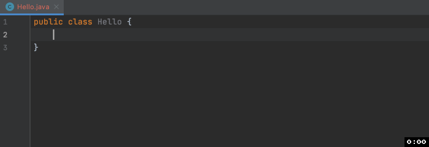

### 1.1.3. Printing things
In Python, we use a function called `print` to print things.
In Java, we use a method called `System.out.println`:

```java
class Hello {
    public static void main(String[] args) {
      System.out.println(7 + 5);
    }
}
``` 

You might wonder why the method has this multipart name. `System` is a class,
and `out` is a static data member defined in that class.
It is an instance of another class that has many methods for printing things,
including `println`. We pronounce this "print line"; this method puts a newline
character at the end of whatever you are printing.

The **semicolon** is the next difference from Python.
In Python, a statement ends when we hit the return key
(unless we add a backslash to say that we want to continue on the next line).
In Java, we use a semicolon to mark the end of a statement.

## 1.2. Variables and Types
### 1.2.1. Flexible Python vs. Strict Java
Python is very flexible about how we use variables.
Consider this interaction with the Python shell:
```python
>>> stuff = ['Jia', 'Musa', 'Vugar', 'Nicole']
>>> type(stuff)
<type 'list'>
>>> stuff = 14.6
>>> type(stuff)
<type 'float'>
>>> stuff = {12345: 'Jia', 55132: 'Vugar', 98765: 'Nicole'}
>>> type(stuff)
<type 'dict'>
```
You may not have noticed how much we are getting away with here.
We were able to assign a value to variable called `stuff` that
Python has never heard of until this moment, we could assign to it
any type of value, and could freely change the kind of value it is given.
This freedom can be convenient, but it also facilitates writing buggy code
if we don't keep careful track of what type of value `stuff` is referring to.
This is why it is so valuable to define type contracts for your functions
in Python.

Java is different. Instead of optional type hints like in Python,
Java uses a statically typed system where type declarations are
*required and enforced by the compiler*. This strict type checking ensures
that we follow type contracts, helping catch many bugs at compile time and
improving overall type safety.

### 1.2.2. Declaring Types
In Python, when we say `type(stuff)`, we are told the type of the object that
`stuff` refers to. The variable `stuff` itself has no type, and it can refer
to an object of any type.

In Java, every value has a type, but so does *every variable*.
We must specify a variable's type before assigning a value to the variable,
and its type can never change. This is called _declaring_ the variable.
As an example:

```java
int i;
```

Here we declare a variable called `i` to be of type `int`.
Space is reserved in memory for this variable, and Java remembers that you
have promised only to assign `int` values to it.

### 1.2.3. Declaration and Assignment
If we wish, we can assign a value immediately after declaring the variable,
even in the same line of code:

```java
int i = 42;
```

In our previous example with just `int i;` we would be postponing assigning
a value to `i` until later. In the meanwhile, the variable's name is known
to Java, space has been reserved to store its value, and it is given a default
value. For an `int`, the default value is `0`; for class types,
it is `null` (the equivalent to Python's `None`).


### 1.2.4. Keeping track of our variables
Java must keep track of four things associated with each variable:

1. The variable's name, which we provide when we declare the variable.
2. The variable's type, which we also provide when we declare the variable.
3. The memory space used to hold the value of the variable.
4. The value of the variable, which can be given using an assignment statement.

The only one of these that can change is the value of the variable.

### 1.2.5. Errors
Java checks as many things as it can, in order to help us avoid bugs.
These are some errors related to variables and types that it can detect:

#### 1.2.5.1. Didn't declare
Here we use a variable that we did not declare:

```java
public static void main(String[] args) {
    i = 42;
}
```
Java gives this error: `"i cannot be resolved to a variable."` In other words,
Java is trying to find a variable called `i` and is unable to.
This could never happen in Python. In Python, if we assign a value to a new name,
Python makes a new variable.

But don't worry, if you forget to declare a variable, IntelliJ will help you out:

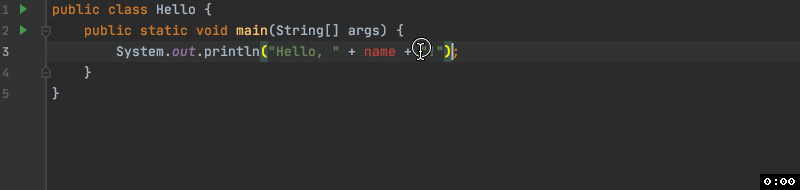

#### 1.2.5.2. Assign value of the wrong type
Here we assign the wrong type of value to a variable:

```java
public static void main(String[] args) {
    int i = 19.6;
}
```
Java gives the error: `"Type mismatch: cannot convert from double to int."`
(Type `double` is like `float` in Python.) Java has caught a type mismatch.
This could not happen in Python, because variables have no type in Python;
only objects do.

Notice that Java tried to be accommodating by converting `19.6` to the
type of variable `i`, but it couldn't. This would have caused a loss of information.
If we instead assigned an `int` value to a `double` variable,
it could have made the conversion. So this code is perfectly fine:

```java
public static void main(String[] args) {
    double i = 19;
}
```

#### 1.2.5.3. Declare a variable using a name that already exists
Here we declare a variable called i, and then do so again.

```java
public static void main(String[] args) {
    int i = 15;
    int i = 42;
}

```

Java gives the error: `"Duplicate local variable i."` This couldn't happen in Python.
In Python, we never declare variables, we just use them. The first time we use a name,
Python creates the variable, and the next time we use the same name,
Python assumes we are referring to the same variable.

## 1.3. Reference Types and Primitive Types
### 1.3.1. More Java types
So far we've seen one type of variable: `int`. Java has many other types, as does Python.
Here are some very simple examples to demonstrate some of these.

```java
// We've seen an int before.
int age = 21;
// Strings must be double-quoted in Java, unlike Python.
String name = "Jude";
// This type is named boolean in Java, rather than bool (as in Python).
// Its values are true and false in Java (with no capital letter), 
// rather than True and False (as in Python).
boolean graduated = false;
// Type double is like float in Python.
double gpa = 3.82;
```

There are additional integer-valued and real-valued types that allow us to
either save memory (and give up precision) or gain precision
(at the cost of using more memory). You can read more in the
[official Java tutorials](https://docs.oracle.com/javase/tutorial/java/nutsandbolts/datatypes.html).

### 1.3.2. References vs. Primitives
In Python, every value you can store, even the simplest thing such
as the integer `1`, is an object. No variable ever stores a `1` directly;
it must instead store a reference to an object of type `int` that contains
the value `1`. You probably learned to draw memory model diagrams where
these references were unique identifiers, like `id17`. As you will see,
those diagrams are still going to be incredibly useful when reasoning about Java code.

However, Java is different. It has two kinds of types:
_reference types_ and _primitive types_. Understanding the difference is
essential for writing correct Java code.

Type `String` is a **reference** type. This is like what you are used to from
Python. A Java variable cannot hold a `String` value directly inside itself;
it can only hold a reference to an object of type `String`.
But type `int` is a **primitive** type. A Java variable can hold an `int` value
directly inside itself.

Conveniently, the primitive types all begin with a *lowercase* letter,
and the reference types with an *uppercase* letter. This makes it easy to tell
whether a type is a primitive or a reference type.

#### 1.3.2.1. Primitives and References in Memory
Suppose we run the following code:
```java
public class Simple {
    public static void main(String[] args) {
        int age = 21;
        String name = "Jude";
        System.out.println("Ciao!");
    }
}
```

Java has to keep track of many things to run code.
Every variable (its name, type, location in memory and value),
every object that has been constructed,
and any method that is running must be tracked.
And we must have a very clear picture of what is happening if we are to
predict what our code will do.

Let's consider the state of computer memory at the moment when we reach the
`println` statement in the code above:

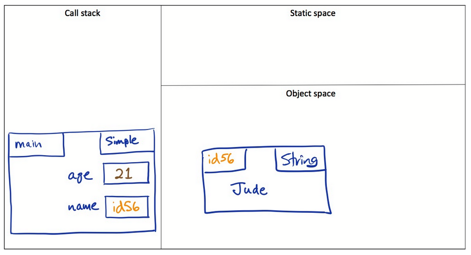

There are three areas in memory:

- The call stack is where we keep track of the method that is currently running.
- The object space is where objects are stored.
- The static space is where static members of a class are stored.
  We'll learn more about that later.

On the call stack, we have a "stack frame" for the `main` method of class `Simple`,
which is currently running. In it we have our two variables.
`age` has the value `21` directly inside it, because `int` is a primitive type.
`name` does not have `"Jude"` directly inside it. Instead, it stores a reference
to a `String` object that contains the value `"Jude"`. Since we did not write the
code for class String, we know nothing about what data members it uses to store
its contents. So we just write the value `"Jude"` inside the box.
This is a perfectly fine abstraction.

The difference between primitive and reference types has many consequences,
including when we copy a value into another variable, when we pass a parameter to a method,
and when we compare two variables to see if they are equal. More on that shortly!

One more thing to notice about our diagram is that we didn't draw any arrows.
Programmers often draw an arrow when they want to show that one thing references another.
This is great once you are very confident with a language and how references work.
But in the early stages, you are much more likely to make correct predictions
if you write down references (you can just make up id values) rather than arrows.

## 1.4. Strings
### 1.4.1. Class `String`
Java has a class `String` that represents sequences of characters.
Let's create a new string object to represent the text Hello:

```java
String s1 = new String("Hello");
```

Notice that we used **double quotes**.
This is required for `String` literals in Java.

Java provides a short-cut for creating string objects,
so you do not have to explicitly say `new`:

```java
String s2 = "bye";
```

This syntax should remind you of how `str` are declared in Python.
However, don't let the lack of `new` fool you into thinking `String`
is a primitive type: it is a reference type.

Strings have various methods available to them. More information on these can
be found using the Java API here: https://docs.oracle.com/javase/8/docs/api/java/lang/String.html

### 1.4.1.1 String Pool

Nevertheless, there is a difference between using the `new` keyword to
create a `String` variable and not using the `new` keyword.
Consider the following Python code:

```
>>> s1 = "Hello"
>>> s2 = "Hello"
>>> s1 == s2
True
```

The final expression evaluates to `True` since the two strings contain
the same sequence of characters.
However, this is slightly different in Java. To avoid excessive memory,
Java has a special "String Pool" to store the values of string literals.
For example, if we create a `String` variable by `String s1 = "Hello"` without
using the `new` keyword, then Java automatically throws the value of the
string "Hello" into the string pool. Now if we create another string variable
by `String s2 = "Hello"` without the `new` keyword as well, to avoid excessive memory,
Java goes to the string pool and looks for this phrase. Since "Hello" has already
been added to the string pool, Java makes `s2` point to the same "Hello" string as `s1`.
In this case, the expression `s1 == s2` will evaluate to `True`, just like in Python.

Now if we have the following code:

```java
String s1 = new String("Hello");
String s2 = new String("Hello");
System.out.println(s1 == s2);
```

We will get `false` as the outcome! The reason is that in this case,
we have created two _instances_ of the `String` class. Hence, since `s1` and `s2`
refer to different objects, the result is `false`.
In summary, be careful with this nuance when comparing values of `String` objects
as this might lead to opposite results.

The above was describing string interning.
You can refer to the following links for more information on the string pool and string interning:
1. https://docs.oracle.com/javase/8/docs/api/java/lang/String.html#intern--
2. https://docs.oracle.com/javase/specs/jls/se8/html/jls-3.html#jls-3.10.5

### 1.4.2. Strings are Immutable
Just as in Python, `String` objects in Java are immutable.
This means that we can never mutate an existing `String` object.
We *can* perform operations on `String` objects, but rather than change an
existing `String`, they return a new one.
For example, see the documentation for the `concat` method at
https://docs.oracle.com/javase/8/docs/api/java/lang/String.html#concat-java.lang.String-.

### 1.4.3. String Operations and Methods
`String` objects can be concatenated to produce a new `String` object:

```java
// We can't change s1 or s2, but we can make a new String out of them.
String s3 = s1 + s2; 
```

Class `String` also has a set of methods, including the following:

```java 
// Indexing
char c = s1.charAt(2);  // In Python: s1[2]
// Slicing
s1 = s1.substring(2, 4); // In Python: s1[2:4]

// Stripping
s1 = "   Here is my string  .   ";
s1 = s1.trim();  // In Python: s1.strip()
```

There are many more useful methods, including `length`, `startsWith`, and `indexOf`.
For the full list, consult Java's online documentation for Class `String` at
https://docs.oracle.com/javase/8/docs/api/java/lang/String.html.

### 1.4.4. Mutable Strings: StringBuilder
Like a `String`, a `StringBuilder` represents a sequence of characters; however,
a `StringBuilder` object is **mutable**. Java provides many methods for mutating
a `StringBuilder`. Here are some examples:

 
```java
StringBuilder sb = new StringBuilder("ban");
// We don't have to create a new object in order to append;
// We can modify sb itself.
sb.append("phone");
// Some of the other methods allow us to modify a StringBuilder:
sb.insert(3, "ana");
sb.setCharAt(3, 'o');
sb.reverse();
```

Again, you can refer to Java's online documentation for more details.

Notice that we did not write:
```java
StringBuilder sb = "ban";
```

This would have generated the error
`incompatible types: String cannot be converted to StringBuilder`.

### 1.4.5. Single Character Strings: char
We can have a `String` that contains just one character.

```java
String s = "x";
```

There is also a primitive type capable of holding a single character.
It is called `char`. We must use single quotes when providing a literal value
of type `char`:

```java
char c = 'x';
```

The `StringBuilder` method `setCharAt` requires its second argument to be of
type `char`. This is why we use single quotes on the `o` when we called the method:
```java
sb.setCharAt(3, 'o');
```

### 1.4.6. Mutating Strings vs. New Strings
We saw that a `String` is immutable but a `StringBuilder` is mutable.
We can live without `StringBuilder` objects if we construct a new `String` every
time we need to make a change. But constructing a new object is slower than
modifying an existing one. For example:

```java
String a = "Joshua";
String b = "Giraffe";
a = a + b; // Constructs a new String -- slow.
```

```java
StringBuilder c = new StringBuilder("Baby");
StringBuilder d = new StringBuilder("Beluga");
c.append(d); // Mutates -- faster.
```

IntelliJ will even point this out to you in some situations and suggest you change your code
(more on loop syntax later):

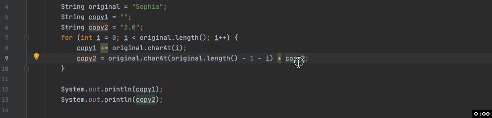

## 1.5. Classes in Java
Although we haven't begun to define our own classes,
other than the simple one we need to contain a `main` method,
we have been using classes, such as `String` and `StringBuilder`. 
Let's look at a few concepts we need in order to confidently write client
code that uses other classes.
In the next chapter, we will learn more about defining our own custom classes.


### 1.5.1. Abstractions

An _abstraction_ is a simplified view of something complex.
For example, in first year, you saw the memory model,
which is an abstraction of how computer memory works for a running program.
We can simplify that memory model further:
an arrow means that a variable contains the memory address of an object
(and thus points to that object),
and so we don't need to write those memory addresses —
the particular memory addresses don't matter, just that the pointer exists.
This is an abstraction on the abstraction!

Classes and interfaces are another kind of abstraction.
When we write a program that manipulates data —
tax information, students at a university, it could be almost anything —
we need to represent that data in our program.
For example, a `Student` class would have a name and student number but probably not weight and height.
Those details are not relevant to the program so we don't need to represent them.
Class `Student` is an abstraction of a student.

### 1.5.1. Instantiating an object

In Python, we can create an instance of a class (in other words: creating an object)
by calling its constructor. For example, assuming we have a `StringBuilder` class defined in Python:
```python
name = StringBuilder("Viriyakattiyaporn")
```

The equivalent in Java requires the use of the keyword `new`. For example:

```java
StringBuilder name = new StringBuilder("Viriyakattiyaporn");
```

In brackets, we provide arguments for the constructor.
The class may offer more than one constructor, in which case the compiler
determines which one we are calling by the number and type of the arguments.

When Java evaluates the expression `new StringBuilder("Viriyakattiyaporn")`,
it:

- allocates memory for the new object,
- evaluates the arguments,
- calls the appropriate constructor, and
- returns a reference to the newly-constructed object.

We can assign the reference to a variable, as we did above, or use it directly,
for instance:

```java
System.out.println(new StringBuilder("Professor").append(" Horton"));
System.out.println(new StringBuilder("Balakrishnan").indexOf("kris"));
```

### 1.5.2. APIs

Now we have a reference to an object that is an instance of some class.
What can we do with it? The documentation for the class will tell us.
If it is a built-in Java class such as `StringBuilder`, we should consult the
[standard Java documentation](https://docs.oracle.com/javase/8/docs/api/) for
full details on the methods and data members of the class that are available to us.
Go there now and find the
[documentation for the StringBuilder](https://docs.oracle.com/javase/8/docs/api/java/lang/StringBuilder.html)
class.

The documentation looks something like this:

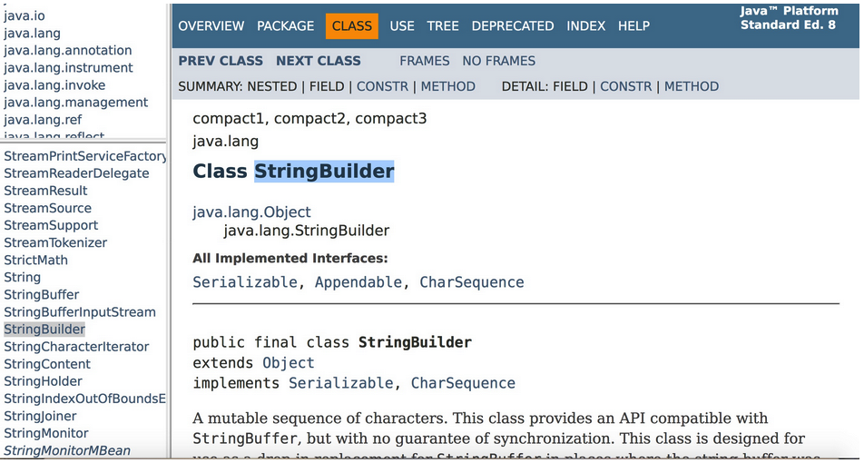

Within that page, find and review the documentation for the constructor that
takes a `String`, the `append` method, and the `indexOf` method.

This documentation specifies exactly how client code can interact with the class,
in this case class `StringBuilder`. We call this the _Application Programming Interface_ or API.
It tells us what methods we can call, what arguments we must send,
and what value will be returned. Be sure to bookmark the Java API
and refer to it regularly.
You will find all sorts of Java resources online, but this is the definitive reference
for the Java API.

Notice that the API does not tell us how the class provides these services.
There are some exceptions, in cases where describing the implementation is the
easiest way to describe important facts about runtime performance of the class, but
the API documentation typically focuses on how to use the provided services.

When we know the interface, not the implementation details,
we are free to think of the class in abstract terms rather than getting bogged down in
details of the implementation -- these don't matter when we are just trying
to _use_ the class.

At the same time, the implementers of the class are free to change the implementation
in any way without having any impact on client code that may already exist.
As long as the API is maintained, all is well. We have the same separation between
interface and implementation, with the same benefits, whenever we define a helper method.

### 1.5.3. Calling methods
Just like in Python, we call an instance method via a reference to an instance of a class.
For example:

```java
String band = "Arcade Fire";
// Call an instance method via an instance.
int size = band.length();

```

You may find it helpful to imagine you are asking the object to do something for you.
For instance, when we write `band.length()` it is like saying
"Hey band, you're a `String`: tell me your length!".

### 1.5.4. Class methods
Some methods are associated not with individual instances of a class,
but with the class as a whole. We call these "class methods"
(or "static methods", since they are defined using the keyword `static`).
We access a class method via the class name. For example:

```java
// Call a class method via the class name.
double x = Math.cos(48);
```

You can think of `Math.cos(48)` as saying "Hey `Math` class, tell me the cosine of 48".

Class `String` has some class methods, including `valueOf`,
which takes an `int` and returns the equivalent `String`.
There are other versions of `valueOf` that can convert other types to String;
we say that `valueOf` is **overloaded** with multiple meanings.
Here is an example of using class method `valueOf`:
```java
int age = 12;
System.out.println("Age is " + String.valueOf(age));
```

It makes sense to say:
"Hey `String` class, tell me the `String` value for this integer age".
It would make less sense to say to a `String` s:
"Hey `s`, you're a String, tell me the String value for the integer age."
This is why the designers of the class made `valueOf` a class method rather
than an instance method.

### 1.5.5. Accessing data members
How we access data members (also known as attributes or instance variables) is
exactly analogous to how we access methods.

If a class has an instance or class variable (also known as a `static` variable)
that is accessible to code outside the class, it can be referred to via an instance
variable or the class name, respectively.

For example, class `Integer` has a class variable called `BYTES` that reports the
number of bytes of memory used to store an `int` value. Since it is a class variable,
we access it using the class name:

```java
System.out.println(Integer.BYTES); 
```

It is more unusual to find an instance variable that we can access outside a class,
since implementation details are usually kept private. But if we had a class called `Sneetch`
with a public instance variable `motto`, we could write:

```java
Sneetch sam = new Sneetch();
System.out.println(sam.motto); 
```

And remember, IntelliJ's code completion can remind you what attributes
and methods are available:

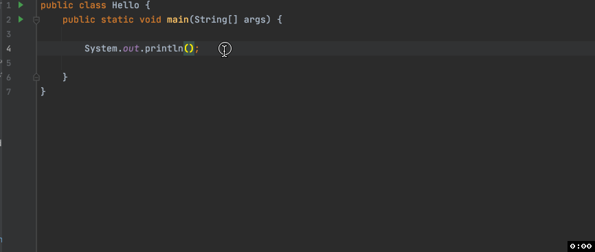

### 1.5.6. Getting rid of unused objects

When we construct an object, memory is allocated for it,
but when is memory ever de-allocated? In some programming languages, such as C,
this dynamically allocated memory is only de-allocated when the code explicitly says to do so.
However, Java does automatic "garbage collection": it keeps track of all objects
and when it can confirm that no variables in the program refer to an object,
it de-allocates that memory, making it available for other uses.

If we know that we don't need an object anymore, we can explicitly drop a reference
by setting the variable holding the reference to `null`.
This can hasten garbage collection and improve performance,
but it may also be unnecessary and just make your code needlessly messy.
There is a good discussion of this on
[StackOverflow](https://stackoverflow.com/questions/449409/does-assigning-objects-to-null-in-java-impact-garbage-collection)
for anyone interested. 


## 1.6. Arrays
Arrays are the simplest type that Java provides for storing a collection of items.
They are a little like Python lists, but much, much simpler. In particular:

- An array has a fixed length. It is set when we construct the array and can never change after that.
- All elements must have the same type, which we must state at the moment when we declare any variable
  that will refer to an array. Essentially, the type of the variable is not just "array"
  (we'll see the Java way to say that in a moment) but "array of `int`" or "array of `string`",
  for example.

### 1.6.1. Declaring an Array

To declare an array, we must:
- say that the type is array, which we do using square brackets, and
- say what type each element of the array will be, which we say
  just ahead of the square brackets.

By convention, we don't put a space between the two.

For example:

```java
int[] numbers;
```

declares an array of `int`. We pronounce this statement "`int` array numbers".

Arrays are reference types. This means that when we declare an array such as `numbers`,
we are creating a variable that will refer to an array.

Arrays in Java are reference types, meaning the variable doesn’t hold
the actual data — it holds a reference to an object that contains the data.
So when we declare variable `numbers`, we’re not creating the array itself,
just a variable that can point to one.

### 1.6.2. Constructing an Array

To actually create the array, we need to create a new object.
This means we must construct the object, and in Java,
we do this with the `new` keyword. You also know that this will call an
appropriate constructor, choosing the right one based on the number and type
of arguments we give. Normally in Java, this looks like an ordinary method call,
except that instead of a method name we give a class name.
For example, if `house` were declared to be of type `String`, you could write
 
```java
String house = new String("Hufflepuff");
```

to construct an object of type `String` and store the value `"Hufflepuff"` in it.

With arrays, we have some special syntax that looks a bit different.
This syntax mimics the syntax used in languages like C,
that pre-date object-oriented programming.
We use the keyword `new` and the name of the type, but rather than round brackets,
we use **square brackets**. The only argument we need send the constructor is the
**size** of the array. Continuing with our `int` array `numbers`, we could construct
it as follows:

```java
int[] numbers = new int[5];
```

An array object now exists in our object space, this object has five spots,
each spot can hold an `int` and has the default value `0`,
and the variable `numbers` refers to the whole object.

In this case, we have defined the size of the array at the time we wrote the code.
It is also possible to determine the size of the array when the program is running,
either by reading it from the input or by computing it from other values.
This is because the size of the array is not part of its type.
The type of our array `numbers` above, for instance, is simply `int[]`;
we can assign any `int` array, of any length, to it.

#### 1.6.2.1. What values before we assign?

We have assigned no values to these 5 spots,
but they are initialized automatically to the default value for an `int`, which is 0.
Each built-in type has a default value, and the appropriate one is used.


#### 1.6.2.2. Another way to construct an array: with an initializer

We can combine array object construction and initialization into one step:
```java
int[] numbers = {1, 2, 4, 8, 16, 32, 64, 128, 256, 512, 1024};
```

As with all assignment statements, the expression on the right-hand side is evaluated first.
Note the syntax of using curly braces around the values on the right-hand side.
This constructs an array object of exactly the right length,
and then initializes the contents of that array by assigning each value at the appropriate index.

Then the assignment statement assigns a reference to the new array object to variable `numbers`.

### 1.6.3. Determining length
We can find the length of an array by accessing its `length` attribute.
Here we use it to construct another array of the same length as `numbers`.

```java
int[] sibling = new int[numbers.length];
```

### 1.6.4. Accessing the array elements
The syntax for accessing elements is as in Python.
For example, to assign a value to the integer at position `1`, we could write:

```java
numbers[1] = 512;
```

Since an `int` is primitive, this value `512` is stored directly in the array.

Array indices start at zero as in many other programming languages.
So our code did not put `512` in the very first spot; it went into the second spot.

Python has some fancy ways of indexing a list For example, if we have this list:
```python
houses = ["Hufflepuff", "Gryffindor", "Slytherin", "Ravenclaw"]
```
we can do these things:
```python
forHarry = houses[-3]   # The third element from the end of the list
enemies = houses[1:2]   # Make a copy of some of the elements by "slicing"
```

Java arrays do **not** offer slicing and do not permit negative indices.
If we try to access an array element at an index that is not between 0 and
the array's length minus one, we get an error. For example, this code:
```java
String[] houses = {"Hufflepuff", "Gryffindor", "Slytherin", "Ravenclaw"};
String forHarry = houses[-3];
```

generates the error
`Exception in thread "main" java.lang.ArrayIndexOutOfBoundsException: -3`.

### 1.6.5. Why have such a restricted type?

We've seen that arrays are more restricted than Python lists.
The biggest restriction is that an array's size can never change.

Why, you may ask, does Java have arrays now that we have invented more
flexible structures such as Python lists? In fact,
Java does have more flexible structures,
including [ArrayList](https://docs.oracle.com/javase/8/docs/api/java/util/ArrayList.html),
and we'll learn about these shortly. But it has arrays also, and this is because
arrays are very efficient. It takes both extra space and extra time in order to
provide a list structure that can grow and shrink to arbitrary sizes.
So Java gives you a choice: If you don't need this flexibility,
you can use a super efficient array; and if you do,
you can use a flexible structure such as `ArrayList` instead.

### 1.6.5.1. Mixing types within an array is made possible by inheritance
We can use inheritance to get around the restriction that every element
of an array must have the same type. Every Java class is a descendant of a
built-in class called `Object`
(similar to how everything in Python inherits from class `object`).
So we can simply declare that our array will hold values of type `Object`,
and then put in any type of `Object` at all. Here's an example:

```java
Object[] miscellany = new Object[5];
// We can put a String object into the array.
miscellany[0] = new String("Songbird");

// If we have a class called Monster, we can put Monster objects in too -- 
// no problem!
miscellany[1] = new Monster("Fred");
// Although it has some special syntax, an array is still a kind of Object,
// so it satisfies the type requirements of our array of Objects too.
miscellany[2] = new int[50];

```

So we can put all these different kinds of objects into `miscellany`,
but when we later access an element of our array, all Java can tell from reading
our code is that it will be an `Object`. This has consequences:
```java
// When we write this line in the IDE, Java will check that the types match,
// as it always does.
// Java knows from the declaration of miscellany that it contains Objects,
// so this assignment is fine:
Object element = miscellany[0];
// But here, Java is not satisfied knowing merely that we are putting
// a reference to an Object into a String variable. What if the Object
// is not a String?! So this line generates an error:
String s = miscellany[0];
```

Of course we know that we put a `String` into that position of the array.
We can tell Java this by **casting** the `Object` to a `String`, that is,
telling Java to treat it as a `String`, with the implied promise that when
Java runs the code, this `Object` will indeed be a `String`.
Here's what it looks like to cast `miscellany[0]` as a `String`:
```java
// In round brackets we state the type that we want to cast to.
String s = (String) miscellany[0];
```
At runtime, if the object we are casting to type `String` didn't turn out
to be a string, we would get a runtime error. Here's an example of that:
 
```java
// This time, we access element 1, which is a Monster. Java doesn't complain
// when it reads the code, but does when we run the code and find that
// it is trying to cast a Monster as a String.
String s = (String) miscellany[1];
```

This code generates the error
`java.lang.ClassCastException: Monster cannot be cast to java.lang.String`.

### 1.6.6. Two-dimensional arrays
We can also create arrays with multiple dimensions.
For instance, here we define an array whose elements are themselves arrays of integers:

```java
int[][] table;
// The type of table is int[][] ("int array array", or "array of int arrays").
// At this point, we have merely a variable with space for a reference, nothing more.
table = new int[50][3];
// Now we have an array of 50 elements, each of which refers to 
// an array of 3 elements, each of which can store an int.
// Variable `table` refers to the whole thing.
// We have to keep the two different dimensions straight.
// This is legal:
table[49][2] = 123;
// This is not:
table[2][49] = 123;
```

#### 1.6.6.1. Irregularly dimensioned arrays!
Notice that we didn't really create a rectangular object;
we created an array whose elements are themselves arrays.
We can create these two levels of arrays separately, if we wish. For example:
```java
int[][] table;
table = new int[50][];
// Now we have an array of 50 elements, each of which can refer to
// an int array, but doesn't yet.
for (int i = 0; i < 50; i++) {
    table[i] = new int[3];
}
// Now we are in the same situation we created above by 
// constructing new int[50][3]
```

This decoupling of the two sizes gives us the flexibility to make irregularly
shaped multidimensional arrays:
```java
int[][] irregular;
irregular = new int[3][];
irregular[0] = new int[6];
irregular[1] = new int[99];
irregular[2] = new int[10];
irregular[1][8] = 170;
```

## 1.7. Aliases
### 1.7.1. Aliasing and its implications

We've learned that Java has two kinds of types: primitive types such as `int`,
which store a value directly inside them, and reference types such as `String`
which store a reference to an object inside them. We must follow the reference
to get to the values and methods stored in the object.

In order to know what our code is going to do, we must always be aware of whether
a variable is primitive or a reference.
This can completely change what happens when our code is executed.

### 1.7.2. With references, we can create aliases

As soon as you create an object, you create the opportunity for two different
variables to refer to that same object. Here's an example:

```java
String name = new String("Justin Trudeau");
String primeMinister = name;
```

Suppose these lines occur inside a `main` method in a class called `Demo`.
After these lines have executed, this would be the state of memory:

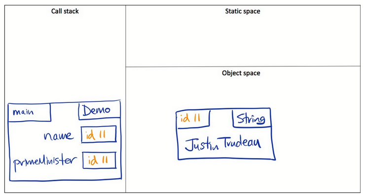

We have two variables referencing the very same `String` object.
Whenever two variables reference the same object we say that they are **aliases**.

Compare this to the dictionary definition of the word "alias"!
An alias is used when a person is also known under a different name.
For example, we might say "Eric Blair, alias George Orwell".
We have two names for the same thing, in this case a person.

We can create an alias in Python in the same fashion as in Java:
 
```python
name = "Justin Trudeau"
primeMinister = name
```

### 1.7.3. With primitives, we cannot create aliases

Returning to Java, if we write the analogous code using `int` instead of `String`,
we _do not create an alias_.

```java
int number = 42;
int answer = number;
```

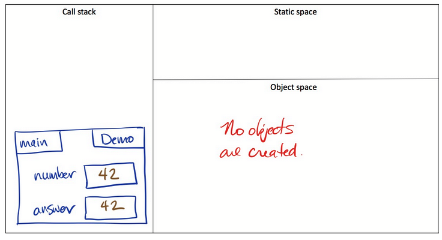

No objects are created, but more importantly, no references are created.
Variables `number` and `answer` each contain their own 42.

Notice that we cannot produce the same situation in Python
because it does not have primitive types.

### 1.7.4. Side effects of aliasing

Just like in Python, there are side effects to aliasing in Java. 
If we have two references to the same object, we have to be aware of this
or our code will do things that surprise us.
 
Suppose we have a class called `Monster`, and it has methods called `grow`
(to make a monster bigger) and `size` (to find out how big a monster is).

```java
// Create a Monster of size 12.
Monster one = new Monster(12);
Monster two = one;
// Increase the size of Monster two.
two.grow();
// Monster two now has size 24.  How big is Monster one?
int n = one.size();
```

Depending on what you believe is going on in memory, you might answer either `12` or `24`.
This is the actual state of memory right before the call to `grow`:
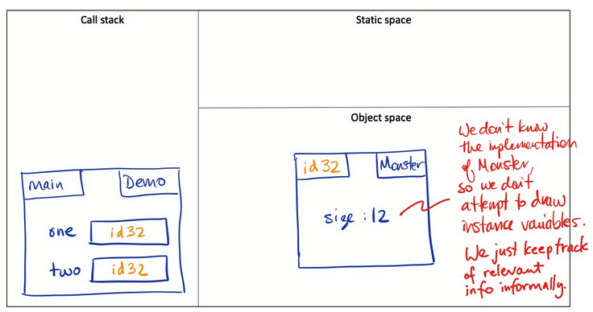

and here is the state after:
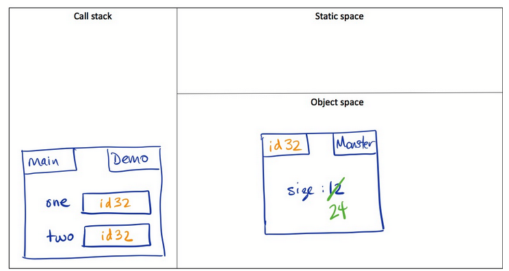

Since `one` and `two` are aliases, changing `two` affects `one`.
More precisely, changing the object that `two` refers to changes
the object that `one` refers to — since they are the same object!

### 1.7.4.1. But only if the object is mutable!
Suppose we have aliases for an object that is immutable,
as in this example from above:
```java
String name = new String("Justin Trudeau");
String primeMinister = name;
```

There is no way to create a side effect because a `String` object cannot be changed.
The best we can do is make a new `String` object. For example:

```java
String name = new String("Justin Trudeau");
String primeMinister = name;
primeMinister = primeMinister.replace('u', 'U');
System.out.println(name);
System.out.println(primeMinister);
```
The output from this code is:
```
Justin Trudeau
JUstin TrUdeaU
```

We did not change `name` by changing `primeMinister`.
In fact, we didn't change the `String` that `primeMinister` refers
to — we made a **new** `String`.

### 1.7.5. Making a copy in order to avoid side effects

We've seen that when two variables are aliases for the same object,
and the object is mutable, we can have side effects.
If we want to avoid side effects, instead of making an alias,
we can make a copy of the object. Here's an example that uses this strategy:

```java
String[] words = {"hello", "bonjour", "adieu", "tschuss", "ciao"};
// This tries to be a copy, but it's not; it's an alias.
String[] copy1 = words;
copy1[1] = "xox";
String[] copy2 = new String[words.length];
for(int i = 0; i < words.length; i++) {
    copy2[i] = words[i];
}
copy2[3] = "yoy";
```

If we were to print `words`, `copy1`, and `copy2` what would the output be?
It is much easier to answer that with a clear picture of what is happening in memory:

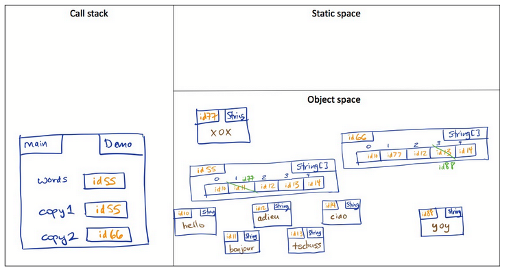

Notice that, despite its name, `copy1` doesn't actually refer to a copy of the array;
it is merely a second reference to the array object we already had.
Changes to the array referenced by `words` show up when you look at the array
referenced by `copy1` (and vice versa) because they are the *same array*.
But `copy2` refers to a second array object. Each of its elements contains a copy
of an element of the first array object. Changing `copy2` has no effect on the
original array, `words`.

### 1.7.6. Shallow copy vs deep copy

Above, we made what is called a *shallow copy*. We copied the reference stored in
`words[0]` and put it in `copy2[0]`, copied the reference stored in `words[1]` and
put it in `copy2[1]`, and so on. But we did not make a copy of the objects that
`words[0]`, `words[1]` and so on referred to. The result is that, even though
`words` and `copy2` are separate arrays, they each point to the same five
`String` objects.

In other words, we have aliasing, but it's at a *deeper* level in the structure.
For example, `words[4]` and `copy2[4]` both refer to the same `String` with ID `id14`.

Since string objects are immutable, there is no chance that the aliasing at
this deeper level can cause the same kinds of problems we saw above.
But if we were copying an array of mutable things, such as arrays or `Monster` objects,
we would have potential for these problems. Here is an example:

```java
int[][] table = {
    {11, 22},
    {5, 10}
};
int[][] copy = new int[2][2];
for (int i = 0; i < table.length; i++) {
    copy[i] = table[i];
}
int[] row = {0, 0};
copy[0] = row;
// Changing copy[0] did not change table.  All is right with the world.
// What happens if we do this?
copy[1][1] = -99999;
```

To predict the outcome, we again need a clear picture of what is happening in memory:

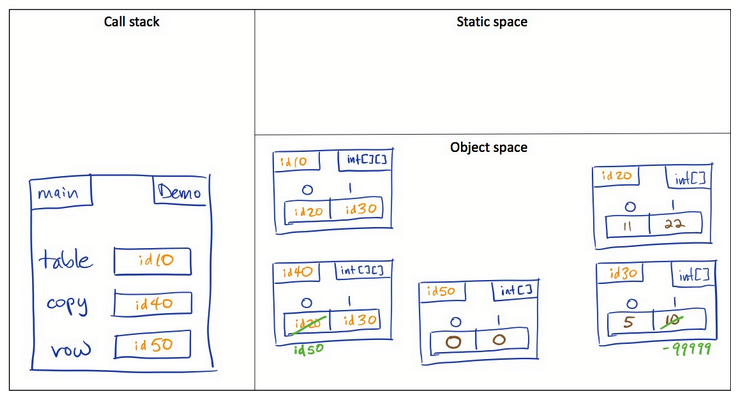

So changing `copy[1][1]` did change table: it has `-99999` at index `[1][1]`.
To avoid this, we would have to make a copy of `table` at *every* level.
This is called a **deep copy**.

### 1.7.7. Other kinds of side effects
These kinds of side effects can also occur when we pass a parameter to a method.
Sometimes this is what we want, and sometimes it is not.

Think back to Python and what happens when you pass lists in as parameters:
modifying the list passed in would modify the original too!
The same concept applies to Java.


## 1.8. Control Structures
In Python, indentation is used to indicate nested code blocks.
Take the following code for example:

```python
class_size = 124
sections = 1;
if class_size > 100:
    sections = 2
    class_size = class_size / 2;
print('Sections: {} and class size: {}'.format(sections, class_size))
```

We can tell what is part of the if-statement (the indented lines),
and what is not (the initial variable assignments and the `print`
statement after the if-statement).

In Java, white space and indentation do not affect program behaviour
(though they are very important for readability!)
Instead, curly braces `{}` are used to define the structure of code blocks.

### 1.8.1. if Statements
`if` statements in Java look very similar to those in Python,
but with a little extra syntax. The simplest `if` statement has just an
if-condition and associated body:
```java
int classSize = 124;
int sections = 1;
if (classSize > 100) {
    sections = 2;
    classSize = classSize / 2;
}

```

The round brackets around the condition are **required** in Java!
The body itself is enclosed within curly braces.
However, if the body of the if-statement has just a single line,
the curly braces are optional. For example:

```java
if (classSize > 500)
    System.out.println("Wow, that's big!");
```

But this code is risky! If we added more code, we might indent it nicely
and fool ourselves into thinking it's inside the if-block:

```java
if (classSize > 500)
    System.out.println("Wow, that's big!");
    sections = 3;               // These lines are OUTSIDE of the if-block!
    classSize = classSize / 3;  // They'll ALWAYS run!
```

But to Java, these extra lines are **OUTSIDE** the if-block.
They happen regardless of the condition. For this reason, you should always use
the curly brackets on your code blocks, even when they are not (currently) required.

Similar to Python, an if-statement can have a sequence of additional conditions,
and they can end with an else. The meaning is just as you've seen in Python,
but notice that we say `else if` rather than `elif`.

```java
int grade = 86;
char letterGrade;
if (grade > 80) {
    letterGrade = 'A';
} else if (grade > 70) {
    letterGrade = 'B';
} else if (grade > 60) {
    letterGrade = 'C';
} else if (grade > 50) {
    letterGrade = 'D';
} else {
    letterGrade = 'F';
}
```

And of course if-statements can be nested.
```java
boolean precipitation = true;
boolean freezing = false;
if (precipitation) {
    if (freezing) {
        System.out.println("Wear boots!");
    } else {
        System.out.println("Bring your umbrella!");
    }
}
```

Remember that it is the **curly braces**, *not* the indentation,
that associates the else with the inner (vs the outer) if-condition.

> **Important**: Unlike Python, Java doesn't have `and`, `or`, and `not` operators.
> The equivalent operators in Java are `&&`, `||`, and `!`, respectively.

### 1.8.2. for Loops
The syntax for a basic for-loop comes from the C language.
C is now quite old, and this syntax feels as though we are doing things
quite "by hand".

This is the general structure of a basic for-loop:
```
for (initialization; termination; increment) {
    loop body
}
```

The header of our for-loop consists of 3 parts:
- The *initialization* is executed once, before any iteration begins.
  It is very often sets a counter to 0, but it can be any statement.
- The *termination* is a boolean condition. If it evaluates to true,
  we execute the loop body and then execute the increment.
- The *increment* is usually, as the name suggests, a statement that
  increments a variable, but it could be any statement.

Here is a simple example, where we find the sum of the first `n` numbers.
```java
int n = 15;
int sum = 0;
for (int i = 1; i <= n; i++) {
    sum += i;
}
System.out.println("Sum of the first " + n + "numbers is " + sum);
```

The 3 parts of this for-loop are as follows:
- `int i = 1` is the *initialization*. Here we initialize a new variable, `i`,
  and give it a starting value of 1.
- `i <= n` is our *termination*. We loop so long as `i <= n` is `true`,
  and terminate otherwise.
- `i++` is our *increment*. This line is equivalent to saying `i += 1`:
  in other words, we increase `i` by 1 at every iteration.

Here we counted from `1` to `n` inclusive
(as our termination condition was `i <= n`). Notice that the initialization
included *declaring* the variable `i`. As long as the initialization is one statement,
it can be anything! It is very common to put the variable declaration in the
initialization because this limits its scope
(the part of the code in which we can refer to it) to the loop.
The variable disappears from our stack frame as soon as the loop is over,
keeping a nice clean namespace.

Here is an example with an array:
```java
int[] powers = {1, 2, 4, 8, 16, 32, 64, 128, 256, 512, 1024};
for (int i = 0; i < powers.length; i++) {
    System.out.println(powers[i]);
}
```

Notice that we count from `0` to `powers.length - 1`:
this is all the valid indices of the array!

#### 1.8.2.1. Enhanced for-loops
Java also provides an enhanced form of for-loop, which is more like what you're
used to from Python. It works on arrays and on "collections",
which you will learn about shortly.

Here's an example with an array:
```java
for (int p : powers) {
    System.out.println(p);
}
```

This is similar to the following code from Python:
```python
for p in powers:
    print(p)
```

This loop is much simpler, and therefore less error-prone than the one
above that uses a regular for-loop. You should use enhanced for-loops whenever possible.

#### 1.8.2.2. Aside: shorthands (++, --, +=, -=)
You may remember shortcuts like `+=` and `-=` from Python, e.g.:
```python
x += n    # Equivalently: x = x + n
y -= n    # Equivalently: y = y - n
```

Java has the same, but with two others:
```java
i++;      // Equivalently: i = i + 1
i--;      // Equivalently: i = i - 1
```

These are handy, and you will very often see i++ as the increment in a for-loop.

But there are other uses of these shortcuts that are difficult to read and
therefore prone to bugs. For instance, Java allows both `++i` and `i++`,
and while they both increment the value of `i` by `1`, they behave differently
when used inside expressions:

- `++i` is _pre-increment_: the value is increased before it is used.
- `i++` is _post-increment_: the value is increased after it is used.

This distinction matters in more complex expressions,
and can lead to subtle bugs if you're not careful.

### 1.8.3. while Loops
In Python, while-loops had the syntax:
```python
while condition:
    ...
```

Java is fairly similar, with while-loops having the form:
```java
while (condition) {
    ...
}
```

A larger example is the following:
```java
int number = 37;
int divisor = 7;
while (number > divisor) {
    number = number - divisor;
}
// We know here that (n > divisor) is false.
System.out.println("Leftover: " + number);
```

The same structural rules hold here as for if-statements:
- The condition must be inside round brackets.
- The while-loop's body needs curly braces if it is more than one line long,
  but it should have curly braces even if it is only one line long.

The meaning of a while-loop is just as in Python.
Each time we hit the top of the loop the condition is evaluated.
If it evaluates to true, we execute the body of the loop and go back to the top.
Thus, when the loop terminates, we know that the loop condition is false.

#### 1.8.3.1. do-while Loops
The do-while loop is another form of a while-loop in Java.

The do-while loop checks its condition after the loop runs, ensuring that
the loop always runs at least once. The syntax consists of the following:
```java
do {
    // your code inside
} while (condition); // Note the semicolon at the end of the block.
```

There is another way for a while-loop to function with a semicolon,
and it involves the increment/decrement operator.
Remember that i++ increments the variable after the condition is checked,
while ++i increments it before it is checked.

```java
int i = 0;

while (i++ < 10);
```

This kind of format of while loop can be used to increment/decrement array
indices until the condition is met. For example:

```java
int [] A = new int [] {2, 4, 6, 8, 10, 12};

int i = 0; 

while (A[i++] < 7); 
```

This kind of code may seem unfamiliar or be confusing,
so usage of this form is not recommended. The information is just for reference.

## 1.9. Parameters

Let's quickly recap some parameter concepts and terminology that are common to Java and Python.

Here's a simple example:
```java
public static void messAbout(int n, String s) {
    // Contents of the method omitted.
}

public static void main (String[] args) {
    int count = 13;
    String word = new String("nonsense");
    messAbout(count, word);
}
```

In the method declaration, each variable defined in the brackets is called a **parameter**.
Here, `n` and `s` are parameters of method `messAbout`. When we call a method,
each variable in the brackets is called an **argument**.
The arguments in our one call to `messAbout` are `count` and `word`.

When we call a method, the following happens:

1. A new stack frame is pushed onto the call stack.
2. Each parameter is defined in that stack frame.
3. The value contained in each argument is assigned to its corresponding parameter.

Then the body of the method is executed. When the method returns,
either due to hitting a `return` statement or getting to the end of the method,
the stack frame for that method call is popped from the call stack and all the
variables defined in it — both parameters and local variables — disappear.

As the wording in step 3 above implies, what we often call "parameter passing" is
essentially an assignment. In the example above, it is as if we wrote

```java
n = count;
s = word;
```

If an argument to a method is a variable, what we assign to the method's parameter
is simply the value contained in the variable.
Let's examine the implications of this in different scenarios.

### 1.9.1. Passing a primitive

What does this code output?
```java
static void increase(int i) {
    i = i + 1000;
}

public static void main(String[] args) {
    int cost = 14;
    increase(cost);
    System.out.println(cost);
 }
```

The answer is `14`. The reason for this behaviour is clear when we consider
what's happening in memory. This diagram shows the state of the program just
before the method assigns a new value to `i`.

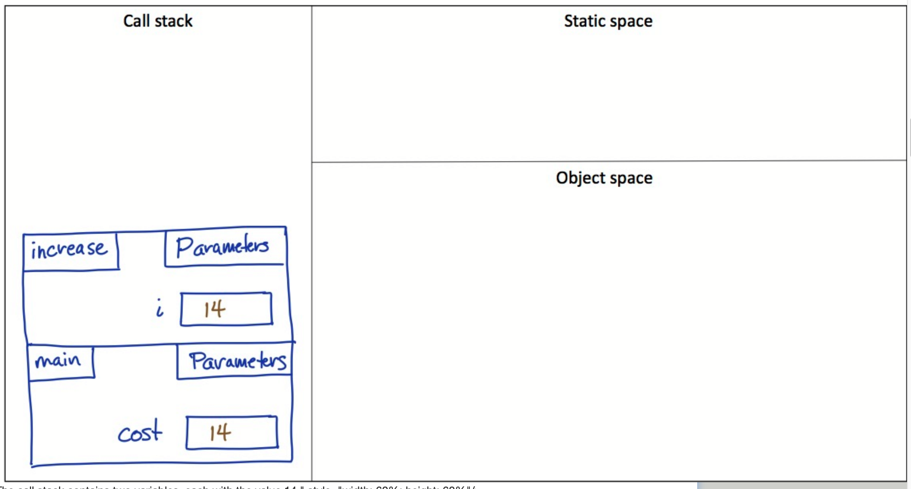

The call stack contains two variables, each with the value `14`.

In particular, variable `cost` and parameter `i` each contain the value `14`,
and clearly changing what is in one box does not affect what is in the other.

This analogous Python program would produce the same output:
```python
def increase(i: int) -> None:
    """Increase i by 1000."""
    i = i + 1000

if __name__ == '__main__':
    cost = 14
    increase(cost)
    print(cost)
```
The reason, however, is different. Can you draw the memory model for this code,
and explain why it also fails to increase `cost`? The diagram will *not* be the same.

How can we use a method to change the value of `cost`?
In either programming language, we use the same approach:
Return the changed value and have the calling code assign it
to the variable we wished to change.

Here it is in Java:
```java
static int increased(int i) {
    return i + 10;
}
public static void main(String[] args) {
    int cost = 9;
    cost = increased(cost);
    System.out.println(cost);
}
```

Notice that we changed the method's name to `increased`.
Now that the method returns a value, it makes sense to use a noun
rather than a verb. The line `cost = increased(cost)` reads nicely.

### 1.9.1. Passing a reference creates an alias
As we learned, if an argument to a method is a variable,
what we assign to the method's parameter is simply the value contained in the box.
If that variable of a reference type, what's in the box is a reference,
so the argument and parameter become aliases.
What can happen next depends on whether the object is mutable.

#### 1.9.1.1. Passing a reference to a mutable object
If we pass a reference to a *mutable* object, we have the potential for side effects.
This is really no different from the kinds of side effects we saw earlier,
when we learned about aliasing.

Side effects are not a bad thing: methods are often designed to create side effects.
You just have to know what you're dealing with (primitive, immutable object, or mutable object)
so that you are sure your code will do what you want.

Here's an example where we pass a reference to a mutable object:
```java
static void increase(StringBuilder sb) {
    sb.append(sb);
    sb.append("!");
}
public static void main(String[] args) {
    StringBuilder word = new StringBuilder("rah");
    increase(word);
    System.out.println(word);
}
```

This is the state of memory immediately before method `increase` returns:
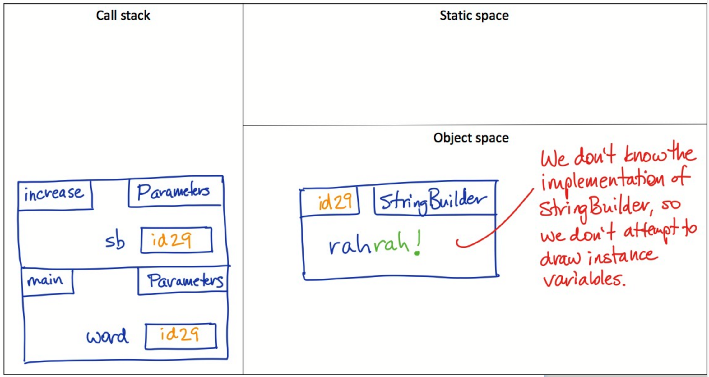
The call stack contains two variables, each referencing the same `StringBuilder` object.

Here are some things to notice:

- When we called method `increase`, a new frame was pushed onto the call stack.
- In the upper left corner of the frame, we write the method name.
- In the upper right corner, we write what the method belongs to, in this case, class `Parameter`.
- The parameter `sb` exists in the stack frame. It comes into being when the method is called.
  And when the method returns, this stack frame will be popped off the stack and discarded,
  along with everything in it. At that point, `sb` no longer exists.
- When we passed argument `word` to parameter `sb`, we assigned its value to `sb`.
  In other words, we copied what was in the box: `id29`. This created an alias.
- `id29` is a reference to a `StringBuilder` object, which is mutable.
  When we used `sb` to access and change that object, the object that `word`
  references also changed, since they refer to the same object!

#### 1.9.1.2. Passing a reference to an immutable object

If we pass a reference to an immutable object, we can do whatever we want with
the parameter and there will be no effect outside the method.
This also is not a bad thing: it depends on what you want.

Here's an example:
```java
static void increase(String s) {
    // We can't call a method to append to s, because String doesn't have
    // such a method.  But we can use the concatenate operator.
    s = s + s + "!";
}
 

public static void main(String[] args) {
    String sound = "moo";
    increase(sound);
    System.out.println(sound);
```

This code prints plain old `moo`. The reason is that,
although we set up an alias just like before, we don't (and can't) change the object
that both `sound` and `s` reference; we make a new object.
Here's the state of memory right before the method returns:

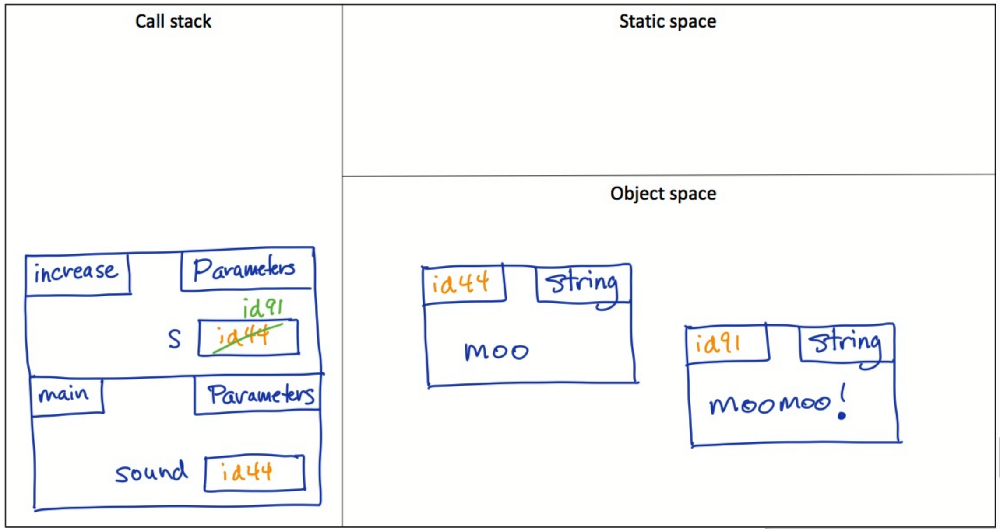

If you want to change the argument, the solution is the same
as when passing a primitive: return the new value and assign it to the argument:

```java
static String increased(String s) {
    return s + s + "!";    
}
 
public static void main(String[] args) {
    sound = "oink";
    sound = increased(sound);
    System.out.println(sound);
}
```

This code prints out `oinkoink!`

#### 1.9.1.3. Compound objects mixing mutable and immutable
The situation gets trickier when we have objects that contain other objects.
The bottom line is this: know whether you are passing a primitive or a reference
type and whether your objects are mutable — at each level of their structure.
Memory model diagrams offer a concise visual way to represent that.
