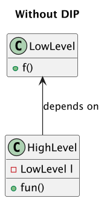
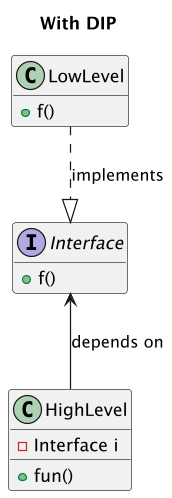
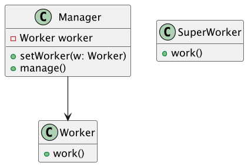

# Chapter 9: Design principles

## 9.1. Toward a set of software design principles

In 1935, Alan Turing came up with a definition of what it meant to be a computer, including a mathematical model of computation (the Turing machine).

In the 1950s, "structured programming" languages were invented — before then, programs were written in assembly language or machine code. (The earliest programs involved flipping switches to set bits!) FORTRAN, COBOL, and LISP were invented for humans to better express algorithms. These programming languages each required a compiler or interpreter to automatically translate programs into machine code.

In the 1960s, [Margaret Hamilton](https://en.wikipedia.org/wiki/Margaret_Hamilton_(software_engineer)) coined the term "software engineering". She was director of the Software Engineering Division at the MIT Instrumentation Laboratory, and is credited for being a [pioneer in reliable software design](https://web.archive.org/web/20101124231727/http://www.nasa.gov/home/hqnews/2003/sep/HQ_03281_Hamilton_Honor.html).

In the 1970s, IBM and others began to study how to design large software systems, and in the mid-70's coupling and cohesion were recognized foundational concepts for good software design.

Up through the 1990s, software development projects often went far over budget and were delivered late. A lot of work went into looking for a "silver bullet" to address this, and many tools and processes were invented. Some of them helped a bit, but no silver bullet was ever found.

## 9.2. The SOLID principles

Over all those decades, software design principles were invented/discovered that helped make software more understandable, maintainable, and flexible with respect to adding new features. A set of five of these principles has been widely accepted as being fundamental to good design, with all of them helping keep coupling low and cohesion high. In the 2000s, Robert Martin proposed that they be consolidated into a single acronym: SOLID.

These [SOLID principles](https://en.wikipedia.org/wiki/SOLID) are very widely used in industry, and often come up in software internship interviews.

Throughout CSC207, we'll use these principles to analyze software design choices.

1. _Single responsibility principle_ (SRP): a class should have only one reason to change
2. _Open/closed principle_ (OCP): a class should be open for extension but closed for modification
3. _Liskov substitution principle_ (LSP): subclasses should be substitutable for their base classes
4. _Interface segregation principle_ (ISP): programmers should not be forced to write or rely on interface methods they do not use
5. _Dependency inversion principle_ (DIP): high-level modules should not depend on low-level modules. Both should depend on abstractions.

### 9.2.1. SRP

> a class should have only one reason to change

This principle is one that is often misrepresented as "each class should have one responsibility", but that simplification doesn't capture the principle's complete meaning.

The SRP means "Gather together the things that change for the same reasons. Separate those things that change for different reasons." (Robert Martin, https://blog.cleancoder.com/uncle-bob/2014/05/08/SingleReponsibilityPrinciple.html)

But who causes the change? An actor!

An _actor_ is a user of the program or a stakeholder — or a group of such people — or even an automated process.

Robert Martin goes on to nicely describe the principle in this way:

“This principle is about people. [...] When you write a software module, you want to make sure that when changes are requested, those changes can only originate from a single person, or rather, a single tightly coupled group of people representing a single narrowly defined business function. You want to isolate your modules from the complexities of the organization as a whole, and design your systems such that each module is responsible (responds to) the needs of just that one business function.” (Robert Martin, https://blog.cleancoder.com/uncle-bob/2014/05/08/SingleReponsibilityPrinciple.html)

Robert Martin went on to say that the SRP is essentially just describing high cohesion and low coupling. There's more to it philosophically, but that's the basic idea.

The SRP helps us design classes that are easier to understand, test, and modify by ensuring that each class responds to a single, well-defined reason for change.

### A small example

Suppose you have a `UserProfile` class that handles both displaying user information and saving it to a database. These are two separate reasons to change: UI changes and database changes. SRP suggests splitting this into two classes: one for display logic and one for data persistence logic.

### 9.2.2. OCP

> a class should be open for extension but closed for modification

The Open/Closed Principle means that you should be able to add new functionality to a program without modifying the existing code.

As examples, IntelliJ and lots of games and other applications have a "plugin" or "extension" system. When you write a plugin, you're writing code that gets called by the main program, but you _don't_ edit the main program's code directly. Instead, the plugin implements a set of methods that the main program will call. This is an example of the Open/Closed Principle in action.

This is often done using inheritance or interfaces. In Java, interfaces can be used to specify the methods that plugin classes needs to implement. That way, the main program doesn't need to know the exact type of the plugin class.

In general, why is modifying existing code considered undesirable when adding new features? Let's consider an example.

### Example: Risks of modifying code

Imagine two developers, Alice and Bob, working on different parts of a project. Both rely on a shared Java class. Bob realizes he needs the class to behave slightly differently for his feature, so he modifies it and gets his part working. But when Alice updates her code, she finds that Bob’s changes have broken her functionality.

This kind of situation is common in collaborative development. When we modify existing code to add new features, we risk breaking other parts of the system that depend on that code. It also makes it harder to understand what the original code was meant to do, and can introduce subtle bugs that are difficult to trace.

The Open/Closed Principle encourages us to avoid this by designing systems where new behavior can be added by extending existing code — through inheritance, interfaces, or composition — rather than modifying it. This helps keep existing functionality stable.

### 9.2.3. LSP

> subclasses should be substitutable for their base classes

Formally, if S is a subtype of T, then objects of type S may be substituted for objects of type T, without altering any of the desired properties of the program.

In Java, T could be a class or an interface. S will either extend class T, or S will implement interface T.

The Liskov Substitution Principle is about ensuring that subclasses can be used wherever their base classes are used without causing problems. This mostly happens naturally, but make sure you're not preventing functionality that worked in the base class from working in the subclass. An important aspect of this is ensuring that type T is well specified so code using it and subtypes are clear about what the expected behaviour should be. Writing well-documented interfaces is thus essential in Java.

### Example: Flightless birds

For example, if you have a `Bird` class with a `fly` method, and then you create a `Penguin` subclass that overrides the `fly` method to throw an exception, that would violate the LSP because penguins can't fly. Any code that expects to be able to call `fly` on a `Bird` would break if it was given a `Penguin`.

Instead, you might refactor the entire design to avoid this issue. For example, you might have a `FlyingBird` subclass of `Bird`, and then have `Sparrow` extend `FlyingBird` and `Penguin` extend `Bird`.

### Example: A square "is a" rectangle

Mathematically, we know that a square is a special case of a rectangle where all four sides have equal length. This is an extra constraint on the side lengths which means that a square is more constrained — or has less functionality — than a rectangle.

Concretely, one could imagine defining `Square` as a subclass of `Rectangle` and running into an issue of matching the expected output when running something like below in a program that calculates the area of a `Rectangle` object:

```java
public static void rectangleDemo(Rectangle r) {
    r.setWidth(2);
    r.setHeight(5);
    System.out.println(r.area()); // should print 10
}
```

If we were to call this method with an argument of type `Square`, the code would certainly not behave as was intended with the parent class. Related to this, it is also clear that it doesn't actually make sense for a `Square` to have `setWidth` and `setHeight` methods at all. This example highlights the importance of how we design our abstractions. While a square is a rectangle mathematically, it doesn't necessarily mean that using the rule of "is a" relationships indicate an inheritance relationship will lead to a well-designed set of classes.

> This example is also discussed in the Clean Architecture textbook.

### 9.2.4. ISP

> programmers should not be forced to write or rely on interface methods they do not use

The Interface Segregation Principle means that no programmer should be forced to depend on irrelevant methods, nor should they be forced to implement irrelevant methods. Let's explore the two aspects of this: first from the implementer perspective and then from the client perspective.

### Implementer perspective

For example, if you have an interface `Animal` with methods `eat`, `sleep`, and `fly`, a class `Dog` that implements `Animal` would be forced to implement the `fly` method, which is irrelevant for dogs.

Instead, you might split the `Animal` interface into smaller interfaces, such as `Eater`, `Sleeper`, and `Flyer`, each with only a method or two. Then, the `Dog` class would implement only the `Eater` and `Sleeper` interfaces.

> With the addition of default methods to Java, it became possible to provide default behaviour, so in the example above another approach would be to have `fly` default to doing nothing so that it only needs to be implemented if relevant to the subclass. [This](http://blog.cleancoder.com/uncle-bob/2015/01/08/InterfaceConsideredHarmful.html) is a fun read related to the interface keyword in Java.

### Client perspective

When you are the client of a class or interface, you do not want to depend on functionality that is irrelevant to your purpose. Consider a case where your class depends on a `Service` interface that provides several methods: `m1`, `m2`, and `m3`. If your class only uses `m1`, then any change to `m2` or `m3` — even if unrelated to your needs — will still require your class to be recompiled and possibly retested. In large systems, this increase in recompilation time can slow down the speed at which your team can iteratively develop your system as you work to add new features.

This creates unnecessary coupling between your code and parts of the system you don’t care about. The ISP tells us to avoid such dependencies by designing smaller, more focused interfaces that expose only what each client actually needs.

> This client perspective is also described in more detail in the CA textbook.

### 9.2.5. DIP:

> high-level modules should not depend on low-level modules

Here, "module" refers to a class or a set of closely-related classes, such as might be found in a `.java` file.

When building a complex system, programmers are often tempted to define _low-level_ classes first and then build _higher-level_ classes that use the low-level classes directly. Here, low-level refers to the details of the implementation. Such details are often volatile and may change without warning, and they correspond to external dependencies. In contrast, high-level refers to what really matters in our program. That is, the core logic of what we are trying to accomplish.

But this approach is not flexible! What if we need to replace a low-level class? The logic in the high-level class will need to be replaced — an indication of high coupling.

To avoid such problems, we introduce an abstraction layer between low-level classes and high-level classes. If we can ensure that we design a stable interface between the low-level and the high-level, then we will have established a boundary between them in our code. What this means is that the dependencies in our program will be on the abstraction. So as long as the interface remains the same, we can work on both sides of the interface independently!

### How it works

Consider the following code.



In this code, `HighLevel` directly depends on the `LowLevel`. This means that `HighLevel` is tightly coupled to the implementation details of `LowLevel`, so any change in `LowLevel` could affect `HighLevel`

How do we apply the DIP to this code so that the correctness of the code remains unchanged? We introduce an interface!



Here, we have inverted the dependency by introducing an abstraction:

- `Interface` defines the contract (`f()`).
- `LowLevel` implements `Interface`.
- `HighLevel` depends on `Interface`, not on `LowLevel`.

This example also makes it more apparent why the DIP has its name. When we introduce the interface, we invert the dependency arrow associated with `LowLevel`. Notice that nothing points at `LowLevel` anymore. With this interface in place, we can freely replace `LowLevel` with a different implementation of the interface as needed.

> Of course, if we poorly design `Interface`, then we are no better off, since we now depend on that interface! This means that we need to take great care to define interfaces that are stable and unlikely to require change in the future. The CA textbook comments on this a bit more in its discussion of volatile and stable elements of a system.

### Example: managers and workers

A company is structured with managers and workers. The code representing the company’s structure has Managers that manage Workers. Let’s say that the company is restructuring and introducing new kinds of workers. They want the code updated to reflect this change.

Your code currently has a `Manager` class and a `Worker` class. The `Manager` class has one or more methods that take `Worker` instances as parameters.

Now there’s a new kind of _super worker_ whose behaviour and features are separate from regular workers, but they both have some notion of “doing work”, so we define a new `SuperWorker` class. Our system looks something like this:



To make `Manager` work with `SuperWorker`, we would need to rewrite the code in `Manager` (e.g. add another variable to store a `SuperWorker` instance, add another setter, and update the body of `manage()`)

A solution is to create an `IWorker` interface and have `Manager` depend on this abstraction instead of directly depending on the `Worker` and `SuperWorker` classes.

In this design, `Manager` does not know anything about `Worker`, nor about `SuperWorker`. The code will work with _any_ class implementing the `IWorker` interface and the code in `Manager` does not need to be rewritten.

> This example is adapted from http://www.oodesign.com/dependency-inversion-principle.html

## 9.3. Exercise: examples of SOLID in Java

 We encourage you to think about what you've learned about how Java works so far — what are some examples of language features that align with the SOLID principles?

For example, which principles align with how Java requires the parent's constructor to be called as part of the child's constructor? Or how generics work? Or the `private` keyword? Or the ability to use an interface as a reference type?

Each time you encounter new code or a UML class diagram, you should begin to assess its design through this new perspective based on the SOLID principles.

## 9.4. Beyond SOLID

Principles are nice, but often it is what has been established based on them that is truly practical for programmers. We'll explore how these principles lead to layered architectures and patterns that we can apply when designing programs.
