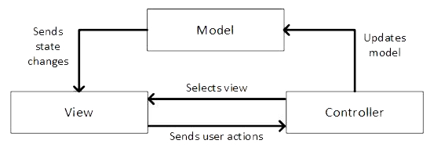
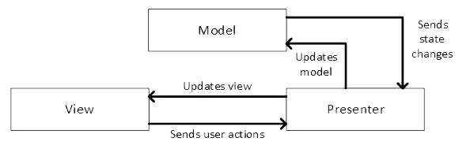

# Chapter 10: Introduction to layered architectures

“Low coupling, high cohesion” is one of the most important concepts in the software development industry. It’s a guiding principle for organizing code so that different parts of a program are easy to understand, test, and change independently.

To achieve this, software is often structured into layers, each with a distinct role — such as managing the user interface, handling data persistence, or implementing the core logic of the program. These layers help reduce dependencies between parts of the program, making it easier to maintain and evolve.
But what exactly are we organizing into layers?

A computer program can be viewed as a set of **policies** — rules that govern how inputs are transformed into outputs. If it helps, you might think of it as a set of rules about how data needs to look at different points in a system. In CS terminology, a policy provides a set of invariants, preconditions, and postconditions.

Policies exist at different **levels**:

- **High-level policies** are far from input/output and represent the core logic of the application.
- **Low-level policies** are close to input/output and deal with things like UI interactions, file access, or network communication.

The level of a policy refers to its distance from the inputs and outputs. Separating policies by level helps isolate the core logic of a program from the technical details of how it interacts with the outside world.

Here are two examples of high-level policies:

- When a user checks out a book, it can't have a hold placed on it by another user.
- When a customer withdraws money from their fancy bank account, they are allowed up to $1000 overdraft.

Low-level policies might describe how users trigger events and how data is stored in a database.

In layered architectures, the goal is to keep high-level policies independent of low-level ones. For example, in a library system, a policy might state that a book cannot be renewed if another user has placed a hold on it. This is a high-level decision about how the system should behave, regardless of how the user interacts with the program or how the data is stored. Whether the user clicks a “Renew” button or the system looks up information from a database are separate concerns. The high-level policy itself remains the same. This separation improves testability, reduces coupling, and makes the system easier to reason about.

Now that we’ve seen how layered architectures can naturally separate policies by level, let’s take a closer look at how programs behave when they run.

> Thought Question: What might a “policy” look like in your code? Is it a method, a class, a rule enforced by a conditional, or something else? 

## 10.1. Event-driven programming: a network of objects

Modern programs often respond to user actions—clicks, keystrokes, and other interactions. These are called events, and programs that react to them are known as event-driven.

When an event occurs, a method called an event listener is triggered. This method receives an event object containing details about the user interaction, like which button was clicked or which key was pressed. The listener then calls other methods to handle the event, forming a chain of method calls across objects.

This chain creates a network of objects, where each method call represents a connection. At runtime, the call stack tracks these method calls, while the heap stores the objects involved. The method at the bottom of the stack is typically the event listener, and the rest of the stack reflects the flow of logic triggered by that event.

To support new user interactions, we write new event listeners and define how they should respond. This connects the user input to the logic that drives our application.

> Review Question: Is an event listener a low-level or high-level policy?

## 10.2. Layers and coupling

Software developers have spent decades refining how to organize code. One widely adopted strategy is to structure programs into layers, where each layer has a specific role—such as managing the user interface, handling data storage, or implementing core logic.
This separation offers several benefits:

- Changes in one layer are less likely to affect others, reducing the risk of bugs and making the system easier to maintain.
- It helps avoid Git merge conflicts by keeping related code grouped together.
- It minimizes the number of files a developer needs to touch when making changes, lowering the chance of introducing errors.
- Code within a layer tends to follow consistent patterns. For example, UI classes often contain event listener methods tied to user interactions.

### It's layers all the way down

A **model** is how you choose to represent the data in the program, such as creating a `Book` class so that you can use `Book` objects to represent the current state of the system. These kinds of objects are often called **entities**.

Models are an important concept, because the entities represent how to think about the data being manipulated. It's particularly important (for testability and maintainability) that models not have any dependencies on the UI layer or the database layer. That means they entities can't mention any classes that you defined in those layers.

> Review Question: What level of policies do entities represent?

Here are a few _architecture patterns_, or ways to think about the organization of a program. You'll encounter these if you start following software design blogs. These are roughly in chronological order for when they were popular:

* model view controller (MVC)
* model view presenter (MVP)
* model view viewmodel (MVVM)
* ports and adapters architecture
* onion architecture
* hexagonal architecture
* clean architecture (the one we will focus on in this course)

They all exist to help keep coupling low and cohesion high, and they all have techniques to cross layers without introducing coupling. They have slight variations on what "model" means and how events are handled, but the core concept of it representing the problem domain data is shared.

### Methods that appear in all of them

You'll need to write an event listener method to handle a user interaction. This method must be in the UI layer.

The event listener method will call a method in the controller/presenter/viewmodel layer, which will call methods that manipulate the problem domain data. Somewhere, there will be code that saves and reads data from a database, file, or network. 

## 10.3. Model View Controller (MVC) architecture pattern

Here is a typical MVC thought process. 

_Retrieved from https://subscription.packtpub.com/book/programming/9781788624060/7/ch07lvl1sec56/the-model-view-controller-pattern on 14 September 2025._

* The user interacts with the View, which creates an event
* The Java system calls a listener method in a View object
* The View immediately calls a method in the Controller to handle the event
* The Controller manipulates the Model
* The Model fetches any necessary data from the database
* The Model calls a method in a View object to let it know that there's been an update
* The Controller decides which screen to display
* The View calls getter methods on the Model and updates the UI

## 10.4. Model View Presenter (MVP) architecture pattern

The MVC architecture pattern was the first one to be widely adopted in the software industry, but the circular dependencies and tight coupling between the View and the Model made it hard to test and maintain. The MVP architecture pattern was developed to address these issues.

You'll notice that the Presenter is largely playing the same role as the Controller in MVP, but the View and Model don't depend on each other.

* The user interacts with the View, which creates an event
* The Java system calls a listener method in a View object
* The View immediately calls a method in the Presenter to handle the event
* The Presenter manipulates the Model
* The Model fetches any necessary data from the database
* The Model calls a method in a Presenter object to let it know that there's been an update
* The Presenter calls methods in the View to update the user interface 

## 10.5. More fine-grained layered architectures

The other architectures — ports and adapters, onion, hexagonal, and clean — are all variations on the same theme. They all have a core layer that represents the problem domain data and logic, and they all have layers around that core layer that handle user interaction, databases, files, and networks.

The core layer is often called the _domain_ layer, and it contains the entities and the business logic. The business logic is the code that implements the rules of the problem domain, such as calculating a student's GPA or determining whether a user has permission to access a resource.

Briefly, the Clean Architecture consists of four layers:

1. Entities: the core layer that represents the problem domain data and logic (highest-level policies)
2. Use Cases: the layer that contains the application-specific business rules (medium-level policies)
3. Interface Adapters: the layer that contains the code that converts data from the format most convenient for the use cases and entities to the format most convenient for the external layers such as the user interface (lower-level policies)
4. Frameworks and Drivers: the layer that contains the code that interacts externally with the user and with any databases (lowest-level policies)

> In the CA book, the terminology of "Enterprise Business Rules" and "Application Business Rules" is used for what we have more informally called the "Entities" and "Use Cases" layers above. 

Here, the Model is in the Entities layer, the Controller/Presenter/ViewModel code is in the Interface Adapter layer, the View and database are both in the Frameworks and Drivers layer, and the Use Case layer contains objects that are specific to a single user interaction. Each will have a method that the Controller calls to handle as much of the user interaction as possible.

We'll explore Clean Architecture in more detail in the next chapter, as it will be the architecture that we focus on in this course.

> Thought Question: Recall that computer architecture also has a layered structure to it as we saw earlier, with applications built on top of the operating system, which is built on top of the hardware.
> You'll find that the idea of layers shows up in many system design contexts. What is it about organizing systems in this way that makes it such a common design?
