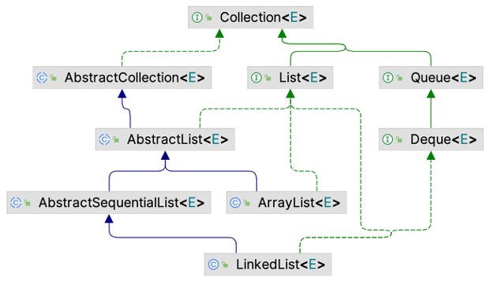

# Chapter XXX: SOLID principles

## XXX.1. Toward a set of software design principles

In 1935, Alan Turing came up with a definition of what it meant to be a computer, including a mathematical model of computation (the Turing machine). 

In the 1950s, "structured programming" languages were invented — before then, programs were written in assembly language or machine code. (The earliest programs involved flipping switches to set bits!) FORTRAN, COBOL, and LISP were invented for humans to better express algorithms. These programming languages each required a compiler or interpreter to automatically translate programs into machine code.

In the 1960s, [Margaret Hamilton](https://en.wikipedia.org/wiki/Margaret_Hamilton_(software_engineer)) coined the term "software engineering". She was director of the Software Engineering Division at the MIT Instrumentation Laboratory, and is credited for being a [pioneer in reliable software design](https://web.archive.org/web/20101124231727/http://www.nasa.gov/home/hqnews/2003/sep/HQ_03281_Hamilton_Honor.html).

In the 1970s, IBM and others began to study how to design large software systems, and in the mid-70's coupling and cohesion were recognized foundational concepts for good software design.

Up through the 1990s, software development projects often went far over budget and were delivered late. A lot of work went into looking for a "silver bullet" to address this, and many tools and processes were invented. Some of them helped a bit, but no silver bullet was ever found.

XXX.2. The SOLID principles

Over all those decades, software design principles were invented/discovered that helped make software more understandable, maintainable, and flexible with respect to adding new features. A set of five of these principles has been widely accepted as being fundamental to good design, with all of them helping keep coupling low and cohesion high. In the 2000s, Robert Martin proposed that they be consolidated into a single acronym: SOLID.

These [SOLID principles](https://en.wikipedia.org/wiki/SOLID) are very widely used in industry, and oten come up in software internship interviews.

Throughout CSC207, we'll use these principles to analyze software design choices.

1. _Single responsibility principle_ (SRP): a class should have only one reason to change
2. _Open/closed principle_ (OCP): a class should be open for extension but closed for modification
3. _Liskov substitution principle_ (LSP): subclasses should be substitutable for their base classes
4. _Interface segregation principle_ (ISP): programmers should not be forced to write interface methods they do not use
5. _Dependency inversion principle_ (DIP): high-level modules should not depend on low-level modules. Both should depend on abstractions

# XXX.2.1 SRP: a class should have only one reason to change

The Single-Responsibility Principle means "Gather together the things that change for the same reasons. Separate those things that change for different reasons." (Robert Martin, https://blog.cleancoder.com/uncle-bob/2014/05/08/SingleReponsibilityPrinciple.html)

Robert Martin went on to say that the SRP is essentially just describing high cohesion and low coupling. There's more to it philosophically, but that's the basic idea.

# XXX.2.2 OCP: a class should be open for extension but closed for modification

The Open/Closed Principle means that you should be able to add new functionality to a program without editing the code.

As examples, IntelliJ and lots of games and other applications have a "plugin" or "extension" system. When you write a plugin, you're writing code that gets called by the main program, but you _don't_ edit the main program's code directly. Instead, the plugin implements a set of methods that the main program will call. This is an example of the Open/Closed Principle in action.

This is often done using inheritance or interfaces. In Java, interfaces can be used to specify the methods that plugin classes needs to implement. That way, the main program doesn't need to know the exact type of the plugin class. Either that or an abstract class can be used to provide default implementations of some methods, while still requiring the plugin class to implement other methods.

[TODO: write up the shape AreaCalculator example as an activity.]

# XXX.2.3 LSP: subclasses should be substitutable for their base classes

Formally, if S is a subtype of T, then objects of type S may be substituted for objects of type T, without altering any of the desired properties of the program.

In Java, T could be a class or an interface. S will either extends class T, or S will implement interface T.

The Liskov Substitution Principle is about ensuring that subclasses can be used wherever their base classes are used without causing problems. This mostly happens naturally, but make sure you're not preventing functionality that worked in the base class from working in the subclass.

For example, if you have a `Bird` class with a `fly` method, and then you create a `Penguin` subclass that overrides the `fly` method to throw an exception, that would violate the LSP because penguins can't fly. Any code that expects to be able to call `fly` on a `Bird` would break if it was given a `Penguin`.

Instead, you might refactor the entire design to avoid this issue. For example, you might have a `FlyingBird` subclass of `Bird`, and then have `Sparrow` extend `FlyingBird` and `Penguin` extend `Bird`.

[TODO: write up Square/Rectangle example as an activity.]

# XXX.2.4 ISP: programmers should not be forced to write interface methods they do not use

The Interface Segregation Principle means that no programmer should be forced to write irrelevant methods.

For example, if you have an interface `Animal` with methods `eat`, `sleep`, and `fly`, a class `Dog` that implements `Animal` would be forced to implement the `fly` method, which is irrelevant for dogs.

Instead, you might split the `Animal` interface into smaller interfaces, such as `Eater`, `Sleeper`, and `Flyer`, each with only a method or two. Then, the `Dog` class would implement only the `Eater` and `Sleeper` interfaces.

[TODO: Paul likes to perform this in class http://blog.cleancoder.com/uncle-bob/2015/01/08/InterfaceConsideredHarmful.html]

# XXX.2.5 DIP: high-level modules should not depend on low-level modules

Methods in the Entities layer should not depend on code in any of the other layers.

The Use Cases layer should not depend on code in the Interface Adapters layer, and code in the Interface Adapters layer should not depend on code in the Frameworks and Drivers layer.

Instead, all layers should depend on abstractions, such as interfaces or abstract classes.

## XXX.3. A case study: the Java Collections Framework

Classes like `ArrayList` and `HashMap` are part of the the [Java Collections Framework](https://docs.oracle.com/en/java/javase/17/docs/api/java.base/java/util/doc-files/coll-overview.html) (JCF), which provides a set of commonly-used data structures and algorithms. All of this code is under package `java.util`.

The JCF has two interface hierarchies, one for collections and one for maps. Collection interfaces include `Set`, `List`, and `Queue`, plus several less-common ones like `Deque` (short for double-ended queue). Interface `Map` (key-value pairs) has a subinterface, `SortedMap`, which provides a total ordering for the keys so that iteration order is predictable. Again, there are other less-common ones.

In the diagram below, the arrows indicate "extends". Notice the little green I's. Those mean "interface".


### XXX.3.1 Interface Set

The people who designed the JCF created lots of classes that implement all these interfaces. Here is the one related to `Set`:


Notice the little blue C's. Those are classes.

At the top is interface `Collection`. A `Set` is a `Collection` where no duplicate elements are allowed.

Abstract class [`AbstractCollection`](https://docs.oracle.com/en/java/javase/17/docs/api/java.base/java/util/AbstractCollection.html) "provides a skeletal implementation of the Collection interface, to minimize the effort required to implement this interface". Class `AbstractSet` both extends `AbstractCollection` and implements `Set`.

`HashSet` implements `Set` directly, and also extends `AbstractSet`. It's the most commonly used Java set implementation. (Thought question: Since `AbstractSet` already implements `Set`, does `HashSet` need to say it implements `Set` again?)

The `HashSet` documentation is interesting:

This class offers constant time performance for the basic operations (`add`, `remove`, `contains` and `size`), assuming the hash function disperses the elements properly among the buckets. Iterating over this set requires time proportional to the sum of the `HashSet` instance's size (the number of elements) plus the "capacity" of the backing `HashMap` instance (the number of buckets). Thus, it's very important not to set the initial capacity too high (or the load factor too low) if iteration performance is important.

Most of the classes in the JCF discuss performance, helping programmers choose the right data structure for their situation.

### XXX.3.2 Interfaces List and Queue

`List` and `Queue` are a bit convoluted:  



Class `AbstractList` extends `AbstractCollection`. `ArrayList` is the most commonly used list implementation.

Class `LinkedList` provides a doubly-linked list implementation, and implements both the `List` and `Deque` interfaces.

### XXX.3.3 Unmodifiable vs immutable collections

The JCF documentation makes a distinction between and unmodifiable and immutable collections:

* Collections that do not support modification operations (such as `add`, `remove` and `clear`) are referred to as _unmodifiable_. Collections that are not unmodifiable are _modifiable_.
* Collections that additionally guarantee that no change in the `Collection` object will be visible are referred to as `immutable`. Collections that are not immutable are `mutable`.

The difference is subtle. Study the following code.
```java
import java.util.*;

public class ModifiableMutable {
    public static void main(String[] args) {
        List<String> modifiableList = new ArrayList<>();
        modifiableList.add("Apple");
        modifiableList.add("Banana");

        // Create an unmodifiable view of the same list — there's aliasing happening somewhere
        List<String> unmodifiableList = Collections.unmodifiableList(modifiableList);

        // unmodifiableList is really just another view on the same list data.
        System.out.println("Original unmodifiable list: " + unmodifiableList);

        try {
            unmodifiableList.add("Cherry");
        } catch (UnsupportedOperationException e) {
            System.out.println("Caught expected exception when trying to modify unmodifiable list: " + e);
        }

        // Modify the underlying list
        modifiableList.add("Cherry");

        // The change is reflected in the unmodifiable view
        System.out.println("After modifying original list: " + unmodifiableList);
    }
}
```

Here is the output:
```
Original unmodifiable list: [Apple, Banana]
Caught expected exception when trying to modify unmodifiable list: java.lang.UnsupportedOperationException
After modifying original list: [Apple, Banana, Cherry]
```

To get an immutable list, use `List.of`, which copies the elements into the new list so that changes to the original list are not reflected in the immutable list.

There are similar methods for `Set` and `Map`.

# XXX.3.4 Random Access

Some classes, like `ArrayList`, provide constant-time access to elements using method `get`. Some do not — remember doubly-linked list performance when accessing the middle of the list.

To indicate that a class provides fast random access, it implements the `RandomAccess` interface. This interface contains no methods! It's purely there so that programmers can better understand how a class performs.

### XXX.3.5 Quotes from the JCF documentation

* Reduces programming effort by providing data structures and algorithms so you don't have to write them yourself.
* Increases performance by providing high-performance implementations of data structures and algorithms. Because the various implementations of each interface are interchangeable, programs can be tuned by switching implementations.
* Provides interoperability between unrelated APIs by establishing a common language to pass collections back and forth.
* Reduces the effort required to learn APIs by requiring you to learn multiple ad hoc collection APIs.
* Reduces the effort required to design and implement APIs by not requiring you to produce ad hoc collections APIs.
* Fosters software reuse by providing a standard interface for collections and algorithms with which to manipulate them.


# XXX.3.6 Design Choices in the JCF

The documentation states that _The main design goal was to produce an API that was small in size and, more importantly, in "conceptual weight." It was critical that the new functionality not seem too different to current Java programmers; it had to augment current facilities, rather than replace them. At the same time, the new API had to be powerful enough to provide all the advantages described previously._

_To keep the number of core interfaces small, the interfaces do not attempt to capture such subtle distinctions as mutability, modifiability, and resizability. Instead, certain calls in the core interfaces are optional, enabling implementations to throw an `UnsupportedOperationException` to indicate that they do not support a specified optional operation. Collection implementers must clearly document which optional operations are supported by an implementation._

# XXX.3.7 Always ask questions!

Lots of programmers have asked lots of questions about [how the JCF was designed](https://docs.oracle.com/en/java//javase/17/docs/api/java.base/java/util/doc-files/coll-designfaq.html). Many design choices could have been made differently.

Here are a few:

Q: Why does `LinkedList` implement both `List` and `Deque`? It could have just implemented `Deque`, since `Deque` extends `Queue`, which extends `Collection`.  But then it wouldn't be usable as a `List`. Which SOLID principles does this seem to violate? Does it seem like a sensible choice?

A: Interface Segregation Principle, because programmers using `LinkedList` as a `List` might be confused by the `Deque` methods. But it also seems like a sensible choice, since a doubly-linked list can be used as both a list and a deque.

Q: The [Java Collections Framework](https://docs.oracle.com/en/java/javase/17/docs/api/java.base/java/util/doc-files/coll-overview.html) documentation says this:

Many of the modification methods in the collection interfaces are labeled _optional_. Implementations are permitted to not perform one or more of these operations, throwing a runtime exception (`UnsupportedOperationException`) if they are attempted. The documentation for each implementation must specify which optional operations are supported.

Which SOLID principle does this seem to violate?

A: Liskov Substitution Principle, because if a method expects to be able to call a modification method on a `Collection`, it might get an `UnsupportedOperationException` at runtime if the actual object is an unmodifiable collection.

Q: Interface `Collection` implements interface `Iterable`, which has a single method, `iterator`. That means any `Collection` can be used in a Java foreach loop.

Interface `Map`, on the other hand, does not implement `Iterable`. Why not? Would it have been a good idea for `Map` to implement `Iterable`? What SOLID principle(s) does this seem to relate to?

Methods `keySet`, `values`, and `entrySet` return views of the keys, values, and entries, and so programmers can choose what behaviour they want.

A: This seems related to the Interface Segregation Principle, because if `Map` implemented `Iterable`, programmers would be forced to use an iterator that might not return what they want. It's unclear whether it should return objects containing key-value pairs, or if it should just return keys, or just values, and any choice might confuse a subset of programmers.

Q: `ArrayList` uses an array to store the contents. When it runs out of room, it makes a new, bigger array and copies over the items. For `add(e)`, `get(i)` and `remove(i)`, what are the best case running times? Worst? When does it perform well?

`LinkedList` uses a doubly-linked list. For `add(e)`, `get(i)` and `remove(i)`, what are the best case running times? Worst? When does it perform well?

When would you choose `LinkedList` over `ArrayList`?

A:

* `ArrayList`: when you need fast random access, and you don't do a lot of insertions and deletions in the middle of the list. 
* `LinkedList`: when you do a lot of insertions and deletions in the middle of the list, and you don't need fast random access.