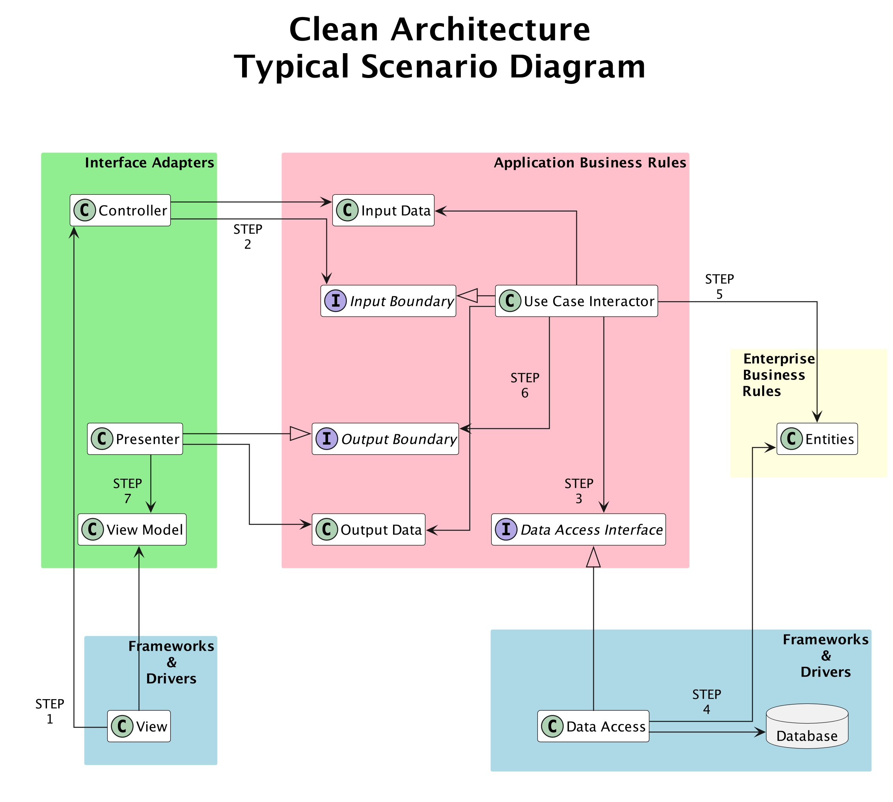

# Chapter 11: The Clean Architecture

In the last chapter, we explored how software systems can be organized into layers that separate high-level policies from low-level details.
In this chapter, we’ll take a closer look at how the Clean Architecture defines these layers, how they interact, and how we can build a system — our "CA engine"  — that respects these boundaries.

## 11.1. The Dependency Rule

The Clean Architecture has one rule, called the **"Dependency Rule"**. This rule states that dependencies in our system must all point inwards — from lower-level policies to higher-level policies.

> Review Question: Why shouldn't a high-level policy depend on a low-level policy?

This is often visualized through the following concentric ring diagram. The highest-level policies, the Entities, are at the core of the architecture, with the lowest-level policies, the Frameworks and Drivers, on the outside of the architecture.

At this point, you may be wondering how information can flow from the inner layers back out to the outermost layers. This is where the Dependency Inversion Principle comes in handy!
The diagram in the bottom corner above nicely summarizes how the DIP can be applied to allow for the dependencies to point inwards while allowing the flow of information to go from the inside to the outside. We'll also see this when we next look at a more concrete UML class diagram representing what a typical implementation of the Clean Architecture might look like.

## 11.2. The Clean Architecture Engine

In the CA book, a typical scenario is presented. Below is a UML class diagram for that typical scenario.

When we create instances of the various classes shown above and connect them together, we are constructing what we will refer to as our "CA engine".

> Thought Question: Take a minute to study the diagram. Can you identify where the DIP has been applied to ensure that we are following the Dependency Rule?

## 11.3. Clean Architecture By Layer
Before we fully talk through how we construct the CA engine and trace the flow of control, let's quickly look at all the pieces that make up our CA engine. Refer to the diagram as you read about each piece. 

### 11.3.1 Frameworks and Drivers

- `View` -- Displays information and reacts to user interaction. The View Will ask a Controller to do something the user wants. The information that the View displays is stored in a ViewModel. When the View Model is updated, the View is alerted and will display the new information to the user.

- `Data Access` -- This class reads and writes persistent data to a file or database outside the program. It is again a detail and implements the Data Access Interface specified by the Use Case layer. It will create temporary Entities that the Use Case uses to do its work.

### 11.3.2. Interface Adapters

- `Controller` -- Converts the raw user data to something useful (for example, a string to a Date object, or a float to a currency value), creates an Input Data object containing that info, and calls a method to start a Use Case, passing in the Input Data.

- `Presenter` -- A Presenter class receives information (an Output Data Object) from the Use Case Interactor and turns it into raw strings and numbers to be displayed. The presenter will update the View Model with this information.

- `View Model` -- This is a storage class for information the View needs to display. Does the View display the currently logged-in user's name? Then the View Model stores that name. The View accesses the View Model for any information it needs.

### 11.3.3. Use Cases

The Use Case layer contains the Use Case Interactors and is responsible for the main actions of the program. If your program is a calendar app, this layer creates and searches for events. If your program is a messaging app, this is the layer that creates new messages, stores them, retrieves conversations, and any other functionality. This layer incorporates the logic of anything the user of your application can do.

- `Use Case Interactor` -- Takes the Input Data and executes the use case, looking up information in the Data Access object when necessary and manipulating Entities. This might create new data that needs to be saved through a Data Access object. When complete, create an Output Data object — the use case result — and pass it to the Presenter.

- `Input Data` -- The Controller creates this object and stores input from the user in it. Then this object is passed to the Use Case Interactor. It is designed to be in a format most convenient for the Use Case Interactor to do its job.

- `Output Data` -- This class represents the result of executing the Use Case Interactor. The Use Case Interactor creates this object and sends it to the Presenter through the Output Boundary.

The interfaces that are built into this layer are:

  -`Input Boundary` -- This is implemented by a Use Case Interactor. Controller classes call the methods in this interface.

  - `Output Boundary` -- This is implemented by a Presenter class. A Use Case Interactor calls the methods in this interface.

  - `Data Access Interface` -- This is implemented by a Data Access class. It specifies how the Use Case Interactor will need to access data in order to perform its job.

> Note that these interfaces are viewed as belonging to the Use Case layer and fully specify the core logic of our system — _everything_ else is just a detail!

### 11.3.4. Entities

The Entity layer contains the program's "Model" or temporary information storage. The "Enterprise Business Rules" (highest-level policies) are enforced by this layer. For example, the "Enterprise" behind ACORN is the University of Toronto. So if U of T does not let a student enrol in more than 7 course in the same semester, the Student entity class will enforce this rule.

- `Entity` - This is a class that stores information about the building blocks of your program. For example, a car rental app might have classes to represent individual cars (a Car class), individual renters (a Renter class), and so on.

## 11.4. Our CA Engine in Action
The following diagram is the same one we just looked at, but with the flow of control shown.

> Take a second to trace the flow for yourself and then read through the more detailed example trace below.

### Step 1: View -> Controller
- the user interacts with the View, triggering an event that contains input from the user that is passed to the Controller.

### Step 2: Controller -> Input Boundary (implemented by a Use Case Interactor object)
- The Controller bundles the input from the user into an Input Data object and passes that through the Input Boundary (i.e., calls a method defined in the Input Boundary interface that takes an Input Data object as a parameter).

### Step 3: Use Case Interactor -> Data Access Interface (implemented by a Data Access object)
- As part of its work, the Use Case Interactor may need to read data through the data access interface. For example, it may request to get an Entity object given information from the Input Data object that was passed in by the Controller.

### Step 4 Data Access -> Database
- The Data Access object does what it needs to do to read data from whatever database is used to actually store the data. 

### Step 5: Use Case Interactor -> Entities
- Once the Use Case Interactor has the Entity objects that it needs from the Data Access object, it uses the methods of the Entities to complete its work.

> At this point, the Use Case Interactor may need to call additional methods from the Data Access Interface. For example, to save information. I.e., the order and repetition of steps 3–5 will depend on the details of the Use Case Interactor.

### Step 6: Use Case Interactor -> Output Boundary (implemented by a Presenter object)
- Once the Use Case Interactor finishes its work, it creates an Output Data object and passes that through the Output Boundary (i.e., calls a method defined in the Output Boundary interface that takes an Output Data object as a parameter)

### Step 7: Presenter -> View Model
- The last step is for the Presenter to take the information from the Output Data object and update the View Model to reflect the result of the user interaction. The View will be alerted of this change and can update itself accordingly. At this point, the interaction is complete and the user will see the updated View.

> Thought Question: Note how we never actually return anything to the Controller. What does this suggest about the return type of the method defined by the Input Boundary?

## 11.5. The Main Component

We now know the structure of the classes and interfaces involved, as well as how information flows through our CA engine, but how do we actually build our CA engine in the first place.

The answer is simple — we carefully create instances of everything and connect them together. The UML class diagram we have been using notably omits the details of what methods and instance variables exist. Based on the interactions described though, we can figure out which classes must contain references to other classes (or interfaces). For example, in order for Step 1 above to take place, the View must have an instance of a Controller. Similarly, for Step 2, the Controller must have a reference of type Input Boundary in order to execute the Use Case Interactor.

The main component of our program is responsible for this initial assembly of our CA engine. This involves creating instances
of our various classes and appropriating connecting them together. This is the part of the program where we choose how to
configure our system. For example, which implementation of our various interfaces will be actually plug into our system. This is where the benefit of our design makes itself clear. For example, if we are testing our code, we can use a different Data Access Interface implementation specifically designed for testing edge cases than the implementation we will actually use in the production version of our code.

What this means is that we can create a different main component, sometimes called a "driver", for different purposes.

> Thought Question: Can you imagine how the code for constructing the CA engine might look in practice? We'll see concrete code examples soon, but for now it is a good exercise to think through your mental model of how our above conceptual discussion and the high-level UML class diagram of the CA engine might turn into concrete code.

> Thought Question: Can you identify specific aspects of the design of the Clean Architecture that remind you of each SOLID principle?
> 