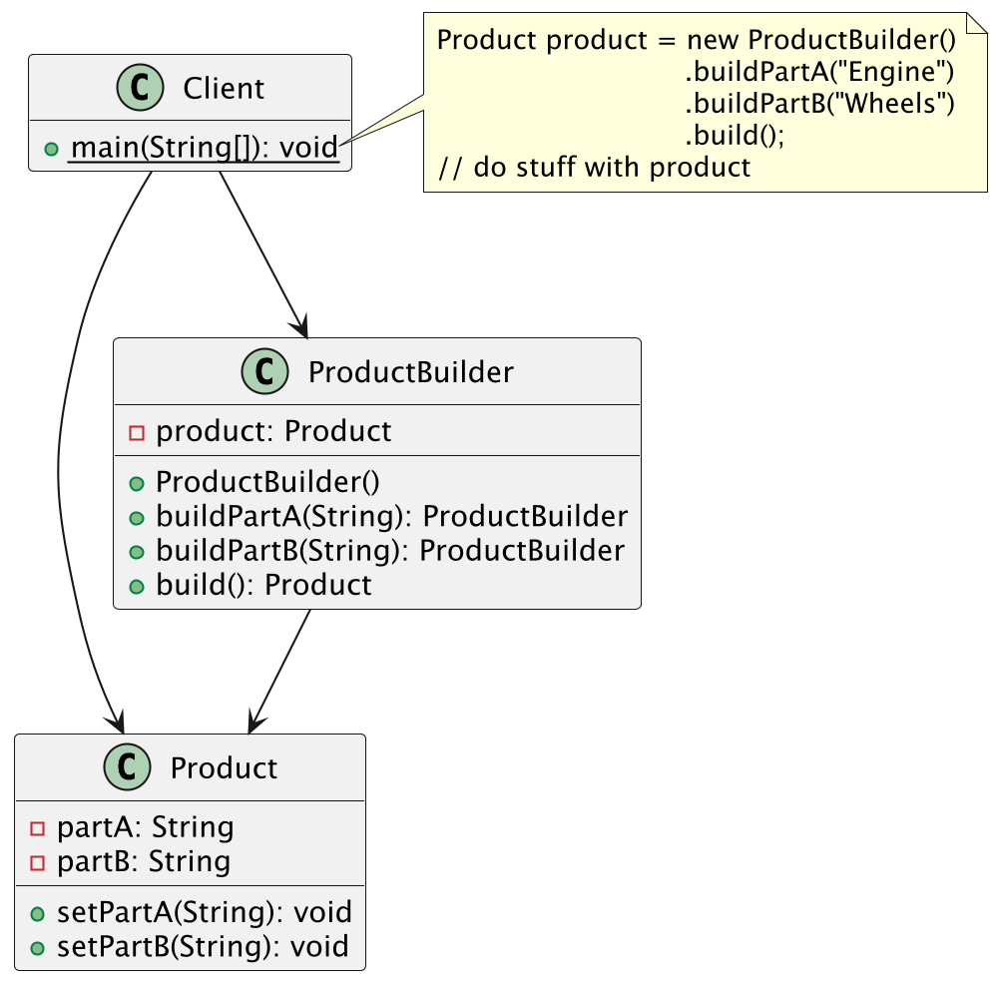
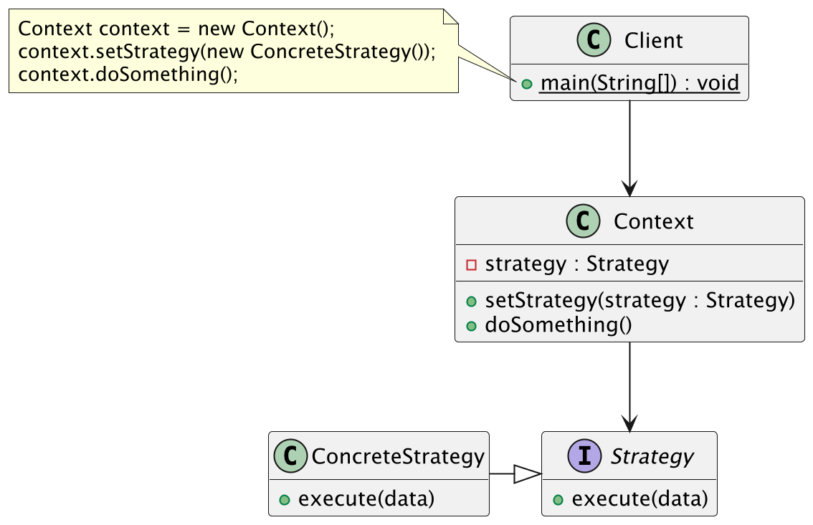
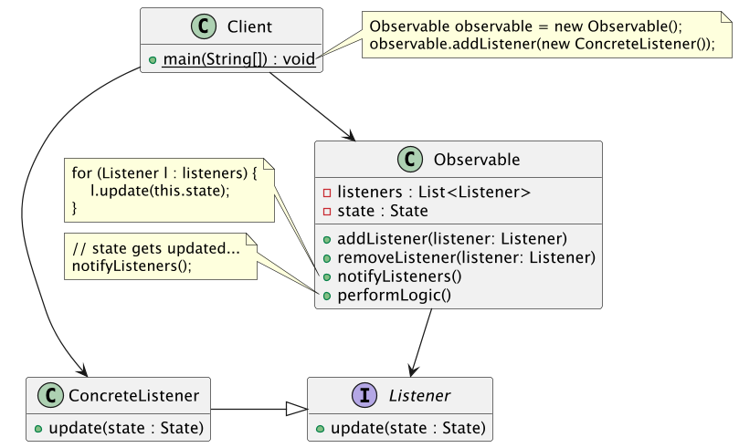
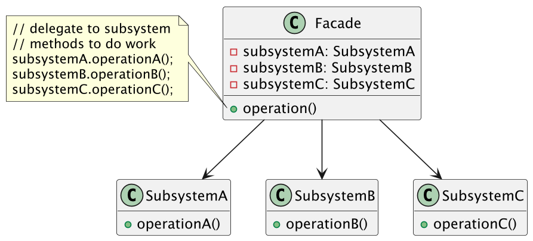
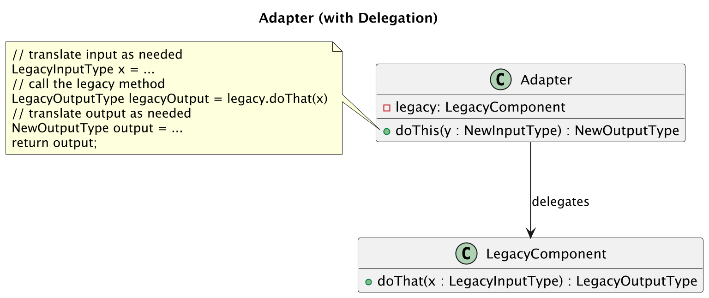
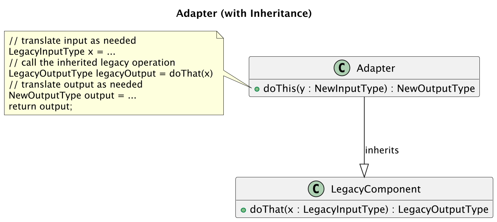

# Chapter 12: Design Patterns

By the end of this chapter, you should be familiar with:
- what a design pattern is,
- what the three broad categories of design patterns are,
- and what two example design patterns from each category look like.

## 12.1 What is a Design Pattern?

**Design patterns** are descriptions of popular solutions to commonly experienced programming problems. If a less convenient solution has been implemented instead, we call that an **anti-pattern**.
If code displays an **anti-pattern** you can improve the design of the code by refactoring to implement the design pattern instead.

These patterns describe the structure of the code rather than the details.
They are a means of communicating design ideas. 
They are not specific to any single programming language.
As such, UML diagrams can naturally be used to explain the structure of a design pattern.

You’ll learn about lots more design patterns in CSC301 (Introduction to Software Engineering) and CSC302 (Engineering Large Software Systems),
but we'll focus on six of them in this course.

### 12.1.1. Relation to Design Principles

Much like what we just learned about the Clean Architecture, design patterns are really just applications of underlying principles,
such as "low coupling and high cohesion" and the SOLID principles.

### 12.1.2. An Analogy: Mathematical Axioms and Theorems

In math, axioms are foundational truths that are assumed to be true without proof.
In software design, design principles (like SOLID) are foundational guidelines that we follow to build "good" systems.
These principles are intended to be quite general.

> Examples:
> - Axiom: Through any two points, there is exactly one line.
> - Principle: A class should have only one reason to change.

In both cases, axioms and design principles are starting points for our reasoning.

In math, theorems are proven results derived from axioms.
In software, design patterns are established solutions derived from applying design principles to common problems.
These patterns are intended to be more practically applicable and less abstract than their underlying principles.

> Examples:
> - Theorem: The sum of angles in a triangle is 180°.
> - Pattern: The Observer pattern solves the problem of notifying multiple objects when one changes.

Design patterns are built on design principles, just as mathematical theorems are built on axioms. As such, you can find some programmers who don't really buy into the notion of learning these patterns at all, since by following their design principles they will inevitably arrive at code following the pattern.
What we do gain from design principles though is a common language to communicate more complex design ideas with other programmers.

To connect this back to our analogy: If someone has already proven a theorem through careful, rigorous application of a set of axioms, would you ever bother to replicate that work — or would you just use their result and apply it to your task at hand?

> Exercise: As you read about each design pattern, think about how you could "derive" each pattern using one or more of our principles.

### 12.1.1. A Brief History


The idea of design patterns was first published by the Gang of Four in 1995.
The original book described 23 patterns: 11 behavioural, 5 creational, and 7 structural patterns.
More patterns have been added since, and other authors have written many more books on the topic.

In the following, we will look at the three categories of patterns, and consider two examples of patterns from each category.
For each pattern, we will focus on what the common programming problem is, and how the pattern solves the problem.

## 12.2. Creational Patterns

Creational patterns focus on the creation of objects. These patterns help avoid common pitfalls such as tight coupling, excessive use of constructors, or inflexible instantiation logic that introduces hard dependencies in our systems.

Fundamentally, creational patterns address the question of where `new MyClass(...)` calls should occur in our code.

> Put another way, these patterns address the question of _who is responsible for creating each object in our system?_

We'll consider Factory and Builder patterns as two representative examples of creational patterns.

### 12.2.1. Factory: theme and variations

**Problem:** You need to create objects that are all subclasses or implementing class of the same abstraction, but you don’t want your code to depend on the exact class names or how they’re built.

**Solution:** Use a special “factory” object or method that decides which class to create and returns a ready-to-use instance.

There are several variations of the Factory pattern, but they all share the same basic idea.

1. The first variation is the **Simple Factory** pattern, which uses a (usually static) method to create objects based on input parameters. This creates a single type of object.
2. The second variation is the **Factory Method** pattern, which uses inheritance to decide which class to instantiate. This creates a single type of object.
3. The third variation is the **Abstract Factory** pattern, which uses composition to delegate the instantiation logic to another object. This creates a family of related objects*.

> *Note: we will not cover the Abstract Factory pattern in this course.

### Simple Factory example

If your program requires `Shape` objects, but doesn't need to know if they are rectangles, circles, triangles, or any other shape that you might want to include in the future, you can instantiate those classes using a `ShapeFactory` class.

```java
public class ShapeFactory { 
    public Shape getShape(String shapeType) {
        switch(shapeType) {
            case "Rectangle": 
                return new Rectangle(); 
            case "Circle": 
                return new Circle(); 
            case "Square": 
                return new Square();
            default:
                throw new IllegalArgumentException(
                        "Wrong shape type: " + shapeType
                );
        }
    }
}
```

The user can then input a string to make shapes:

```java
ShapeFactory shapeFactory = new ShapeFactory();
Shape shape = shapeFactory.getShape(userInput);
// do something with the shape...
```

> Note: you will sometimes see variants of this where the `getShape` method would be defined to be _static_, in which case
> the code simplifies to:
>
> `Shape shape = ShapeFactory.getShape(userInput);
> 
> since we don't need to create an instance of the `ShapeFactory` at all!

### Factory Method example

Let's look at the same example, but written using a factory method instead.
With the simple factory, we ended up with conditional logic inside the `ShapeFactory.getShape` method based on what kind of `Shape` was requested.
When adding a new shape, this means we need to modify this method.

With this observation, a factory method can be used to shift this conditional logic out of this method entirely. This means
that the user will specify the type of shape they want to create _before_ they make the factory.

The first class we need is then an abstract class that defines what it means to be a "shape factory":

```java
public abstract class ShapeFactory {
    public abstract Shape getShape();
}
```

Then we define our subclasses for each shape we want to be able to create:

```java
public class RectangleFactory extends ShapeFactory {
    public Shape getShape() {
        return new Rectangle();
    }
}

public class CircleFactory extends ShapeFactory {
    public Shape getShape() {
        return new Circle();
    }
}

public class SquareFactory extends ShapeFactory {
    public Shape getShape() {
        return new Square();
    }
}
```

Then our client code needs to actually use the factory of its choosing to create the `Shape` that it wants:

```java
public class Main {
    public static void main(String[] args) {
        ShapeFactory factory = new CircleFactory();  // could be chosen based on user input
        Shape shape = factory.getShape();
        // do something with the shape...
    }
}
```

Of course, if we decided on which factory to use based on user input, then that conditional logic from our Simple Factory version
would again appear, but where this logic appears in the code has changed. Most notably,
once we have determined which factory we are using, there is no longer any conditional logic anywhere else in our code.

### UML Class Diagram for the Factory Method

The Factory Method can be represented with a UML class diagram as below:


The client uses a provided factory to create instances of the product that it needs for its work. 

### Simple Factory and Factory Method Comparison

We'll end off our discussion of factories with a quick summary of how the key aspects of the Simple Factory and Factory Method differ:

Aspect | Simple Factory                                 | Factory Method                            |
-------|------------------------------------------------|-------------------------------------------|
Creation logic | All in one class                               | Distributed across subclasses             |
Adding new types| Add a new if-statement (modify existing code)  | Add a new subclass (extend existing code) |
Client usage | Client specifies type through String parameter | Client chooses the factory                |

---

### 12.2.2. Builder

**Problem:** Creating a complex object with many parts or options makes your code messy and hard to read.

**Solution:** Use a step-by-step “builder” that assembles the object piece by piece, then gives you the finished product.

Recall the Hatchimal `toString` method:

```java
    public String toString() {
        return new StringBuilder()
                 .append("Hatchimal{")
                 .append("name='").append(name).append('\'')
                 .append(", rarity=").append(rarity)
                 .append('}')
                 .toString();
        }
```

This follows a pattern:
- Create a "builder" object (in this case, a `StringBuilder`)
- Add parts to it step-by-step. (Here, by calling `append()` multiple times)
- Get the final product. (Here, by calling the builder's `toString()` method)

You may also recognize this pattern from the `Okhttp` code we used to make API calls previously:

```java
Request request = new Request.Builder()
                .url(String.format("%s/grade?username=%s", API_URL, username))
                .addHeader(TOKEN, getAPIToken())
                .addHeader(CONTENT_TYPE, APPLICATION_JSON)
                .build();
```

This again demonstrates the same sequence of creating the builder, performing a sequence of steps to customize the object being created, and then a final call to return the object.

> IntelliJ includes a refactoring feature to [replace constructor with builder](https://www.jetbrains.com/help/idea/replace-constructor-with-builder.html).

### UML Class Diagram for Builder

The Builder pattern can be represented using a UML class diagram as below:



> Note that this is a simplified version of what you may find if you look up the Builder pattern online. We present this version, as it is what you will most likely come across in practice.

## 12.3. Behavioural Patterns

Behavioral patterns focus on how objects interact and communicate.
They address the question of how responsibilities and behaviors are distributed across the objects in our system, and how those objects communicate to get things done. We'll consider the Strategy and Observer patterns as two representative examples of behavioural patterns.

### 12.3.1. Strategy

**Problem:** You have several ways to do the same task, and you want to switch between them easily.

**Solution:** Put each method into its own class and make them interchangeable, so that you can change the algorithm without changing the code that uses it.

For example, consider a class called `Map` that requires a `getDirections` method which should return a different `String` depending on whether the directions are for driving or public transit.
```java
public class Map {

	private DirectionGenerator dg;

	public Map(DirectionGenerator dg) {
	    this.dg = dg;
	  }

	public getDirections() {
	    dg.getDirections();
	   }
}
```

We call the `DirectionGenerator` interface the Strategy and have classes `DrivingDirections` and `TransitDirections` implement it.
When the `Map` class is instantiated, it is given an object implementing the Strategy.

### UML Class Diagram for Strategy

Here is the UML for the Strategy pattern:



In our example, the `Map` is the Context. `DirectionGenerator` is the Strategy interface, and `DrivingDirections` and `TransitDirections` are the Concrete Strategies.

> Extra:
> - Setting which Strategy to use is often done either through the constructor (like in the example) or a setter (like in the UML class diagram).
> - Strategies often correspond to code that may be useful in multiple contexts.

---

### 12.3.2. Observer

**Problem:** Multiple parts of your program need to react when an object changes, but you don’t want tight coupling between those parts and the object being observed.

**Solution:** Define a one-to-many relationship: when the observed object changes, all related objects get notified so that they can respond. The observed object doesn't need to know anything about the specifics of the objects observing it.

For example, consider the `ActionListener` objects we attach to `JButton` components. When the button is clicked (event), the listener’s `actionPerformed` method is called (reaction).

### ViewModel example

Remember the View part of CLean Architecture? Each View has a corresponding ViewModel that holds the data to be displayed. When the data in the ViewModel changes, the View needs to update itself to reflect the new data. This can be accomplished using the Observer pattern: each View will observe its ViewModel.

### UML Class Diagram for Observer

Here is the UML class diagram for the Observer pattern.



An Observable's job is to notify all its Observers when it changes. In our example, a ViewModel is an Observable, and a View is an Observer.

> In Java, this is usually accomplished by having the Observable use a `java.beans.PropertyChangeSupport` object, which manages a list of `PropertyChangeListener` objects (the Observers) so that you don't have to write the code that manages the list of Observers yourself.
>
> When the Observable's state changes, it calls the `firePropertyChange` method of its `PropertyChangeSupport` object, which in turn calls the `propertyChange` method of each PropertyChangeListener.

### Code example

```java
public class LoginView extends JPanel implements ActionListener, PropertyChangeListener {
    
    // Other methods not shown.
    
    public void propertyChange(PropertyChangeEvent evt){
        // React to the change event.
        final LoginState state = (LoginState) evt.getNewValue();
        setFields(state);  // This method will update the View's fields based on the data in the new state.
    }
}
```

Here is a simple ViewModel that uses `PropertyChangeSupport` to notify its Observers when its state changes. In the Login example, this happens in each Presenter when it is done updating its ViewModel.
```java
public class ViewModel<T> {
    private final PropertyChangeSupport support = new PropertyChangeSupport(this);
    
    public void addPropertyChangeListener(PropertyChangeListener listener) {
        this.support.addPropertyChangeListener(listener);
    }

    // This gets called when the state changes. (The Presenter  It delegates to a helper method, below.
    public void firePropertyChanged() {
        this.support.firePropertyChange("state", null, this.state);
    }

    public void firePropertyChanged(String propertyName) {
        this.support.firePropertyChange(propertyName, null, this.state);
    }
    
}
```

---

## 12.4. Structural Patterns

Structural patterns focus on how classes and objects are combined to form larger systems. Unlike creational patterns, which deal with _how objects are created_, and behavioral patterns, which deal with _how objects interact and share responsibilities_, structural patterns address _how components are connected and organized_. They often solve problems such as presenting a simplified, unified interface to a complex subsystem or adapting incompatible interfaces. We’ll consider the Adapter and Façade patterns as two representative examples of structural patterns.

### 12.4.1. Façade

**Problem:** A subsystem exposes many classes and operations to clients, forcing them to deal with unnecessary complexity.

**Solution:** Create a simple client-facing class (the façade) that provides methods for common tasks while hiding the subsystem's complex details.

For example, you may recall the `EmployeeFacade` class in the "Single Responsibility Principle" section of the SOLID slides that contained variables of type:
- `EmployeeCalculator` that is responsibility for calculating the employee's pay,
- `EmployeeReporter` that reports the employee's hours, and
- `EmployeeSaver` that sends the updated employee information to a database.

When you call `employee.calculatePay()` the code that is actually executed is this method, which delegates work to the appropriate private variable:

```java
public class EmployeeFacade {

    private PayCalculator payCalculator;
    private HourReporter hourReporter;
    private EmployeeSaver employeeSaver;
    
    public float calculatePay() {
       return this.payCalculator.calculatePay();  // Notice the 1-line delegation 
    }
    
    // The other methods go here and are structured the same way. They delegate to the appropriate object.
}
```

### UML Class Diagram for Façade

Here is the UML class diagram for the Façade pattern:



> Side note: When constructing a façade, a creational pattern such as Builder can be useful for assembling its internal components in a systematic way.

---

### 12.4.2. Adapter

**Problem:** Two components can’t work together because their interfaces don’t match. This often happens when you need to reuse an existing class that was designed for a different context.

**Solution:** Introduce an adapter — a class that translates between the expected interface and the existing one. The adapter exposes the interface your client code expects and internally forwards calls to the legacy class, converting inputs and outputs as needed. This can be done by:

- Delegation: The adapter holds a reference to the legacy class and delegates work to it.
-Inheritance: The adapter extends the legacy class and adds code to be consistent with the expected interface.

> Analogy: Think of a USB-C to HDMI adapter. Many laptops can output video through USB-C, but your monitor only accepts HDMI input. The adapter doesn’t change the laptop or the monitor — it simply translates between the two interfaces so that they work together.

### Code Example

Suppose we have a class called `Ticket` that was originally written for a lottery program. If the number on your ticket matches a randomly selected number, you win.

Now imagine we want to reuse that `Ticket` class in a program that sells tickets for a movie theatre. The original class doesn’t support seat numbers, so we need to adapt it. Here is how this might look using our delegation and inheritance versions of the adapter pattern:

### With Delegation

```java
public class MovieTicket {

    private Ticket ticket = new Ticket(); // the class being adapted
    private String seatNumber;

    public MovieTicket(String seatNumber) {
        this.seatNumber = seatNumber;
    }

    public void sellTicket() {
        // delegate work to the Ticket class and add extra behavior
        ticket.sell();
        System.out.println("Seat: " + seatNumber);
    }
}
```

Here, `MovieTicket` acts as an adapter by holding a `Ticket` instance and delegating calls to it. We add new functionality (seat numbers) without modifying the original `Ticket` class.

### With Inheritance

```java
public class MovieTicket extends Ticket {

    private String seatNumber;

    public MovieTicket(String seatNumber) {
        super(); // initialize the Ticket part
        this.seatNumber = seatNumber;
    }
    
    public void sellTicket() {
        // reuse parent's sell method and add extra behavior
        super.sell();
        System.out.println("Seat: " + seatNumber);
    }
}
```

Here, `MovieTicket` adapts the original `Ticket` class by extending it.

### UML Class Diagrams for Adapter

Here are the UML class diagrams for the two variants of the Adapter pattern. The first version uses delegation and the second version uses inheritance:






----

## 12.5. Summary


| **Category of Pattern** | **Focus**                            | **Key Question**                                                                                                      | **Representative Patterns** |
|-------------------------|--------------------------------------|-----------------------------------------------------------------------------------------------------------------------|-----------------------------|
| **Creational**          | Object creation                      | Who is responsible for creating each object in our system?                                                            | Factory Method, Builder     |
| **Behavioral**          | Object interaction and communication | How are responsibilities and behaviors distributed across objects, and how do objects communicate to get things done? | Strategy, Observer          |
| **Structural**          | Object and class organization        | How can we connect and organize objects to work together?                                                             | Adapter, Façade             |

---
